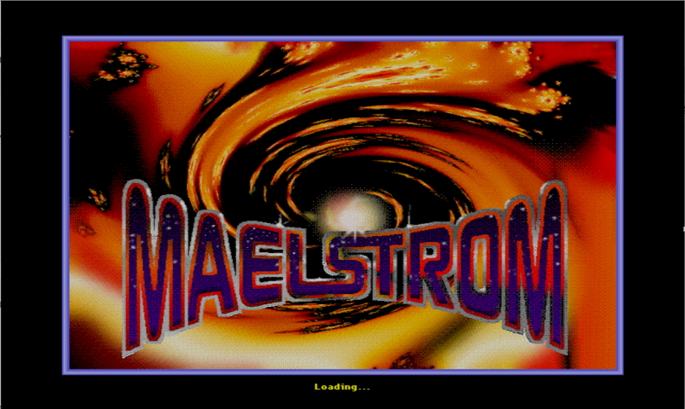
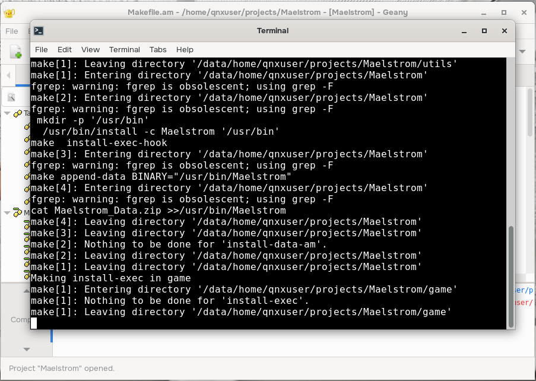

id: build-maelstrom-on-qnx
title: Building Maelstrom on QNX
summary: Learn how to modify and build the game Maelstrom on QNX
categories: self-hosting , SDL games
tags: intermediate
difficulty: 3
status: published
authors: Roberto Speranza
feedback_link: https://github.com/qnx/codelabs/issues

# Building Maelstrom on QNX

## Welcome

Duration: 1:00



Maelstrom is an Asteroids clone, ported to SDL, but was originally created in 1992
for Mac OS. Refer to the Maelstrom Wikipedia entry for more information about the game:

[https://en.wikipedia.org/wiki/Maelstrom_(1992_video_game)](https://en.wikipedia.org/wiki/Maelstrom_(1992_video_game))

<<<<<<< HEAD
The purpose of this project is to build a patched version of the game, ported to QNX, on the QNX Developer Desktop.
=======
The purpose of this project is to build a patched version of the game, ported to QNX, on the [QNX Developer Desktop](https://www.qnx.com/developers/docs/qnxeverywhere/com.qnx.doc.qdd/topic/about.html).
>>>>>>> origin/main

---

## Setup the Project

Duration: 1:00

> aside positive
>
> Note: We will use ~/repos as an example development workspace for the rest of this exercise.  Feel free to use the folder of your choice instead.

1. Navigate to your development workspace:

    ```bash
    cd ~/repos
    ```

2. Run the following command to clone the Maelstrom repo:

    ```bash
    git clone https://github.com/libsdl-org/Maelstrom.git -b Maelstrom3
    cd ~/repos/Maelstrom
    git checkout 063c388fb6e4b7365d005cd25f56844ef94aca51
    ```

    This command will checkout a specific commit from the Maelstrom3 branch.

3. Download the patch from the link below and save it in the repo folder:

    [Maelstrom.patch](./Maelstrom.patch)

4. Run the following command to apply the patch:

    ```bash
    git apply ./Maelstrom.patch
    ```

5. Delete the patch after it is applied.

    ```bash
    rm ./Maelstrom.patch
    ```

---

## Building Maelstrom

Duration: 1:00

This project can be built two ways:

- via command line (Terminal)
- using the Geany IDE

Proceed to the next sections matching your build preference.

---

## Configuring via command line

Duration: 2:00

1. Prepare to configure the project.

    ```bash
    autoreconf -fi
    chmod u+x autogen.sh
    ./autogen.sh
    ```

2. Configure the project.

    ```bash
    CC=clang CXX=clang++ \
    CFLAGS="${CFLAGS} -Wno-reserved-user-defined-literal -Wno-register -Wno-implicit-function-declaration" \
     LDFLAGS=" -L/usr/lib -lSDL2 -lm -liconv -lscreen -lEGL -lsocket" \
    ./configure --with-sdl-prefix=/usr --prefix=/usr --disable-sdltest
    ```

    > This step configures the project to generate the Makefiles needed to build it.  It will take several seconds to complete.

---

## Building via command line

Duration: 5:00

1. Build the project.

    ```bash
    make -j4
    ```

    > This step builds the project.  It will take several seconds to complete.

2. Install the game and its assets.

    ```bash
    sudo make install install-exec install-data install-am
    ```

3. Update the game folder permissions to make it reaable by all users.

    ```bash
    sudo chmod -R a+r /usr/games/maelstrom/*
    ```

---

## Building Maelstrom with Geany

Duration: 7:00

1. Launch Geany. From the desktop, select **Applications > Development > Geany**.

2. Select the **Project** menu, then **Open**.

3. Navigate to the Maelstrom project folder **(~/repos/Maelstrom)** and select **Maelstrom.geany**.

4. Select **Build > Configure**.

    > This step configures the project to generate the Makefiles needed to build it.  It will take several seconds to complete.

5. Select **Build > Make** to build the project.

    > This step builds the project.  It will take several seconds to complete.

6. Select **Build > Install** to install the game.

    

    > A terminal opens. Enter your password when prompted and then the game and its assets will be installed.  It will take a few seconds to complete.

---

## Running Maelstrom

Duration: 1:00

1. Open a Terminal (if one is not open already).

2. Create a script to launch the game to launch it with the QNX screen backend by default.

    ```bash
    sudo vi /usr/bin/launchMaelstrom
    ```

3. Paste this content.

    ```bash
    #!/bin/bash

    SDL_VIDEODRIVER=qnx Maelstrom -windowed
    ```

4. Make the script executable.

    ```bash
    sudo chmod a+x /usr/bin/launchMaelstrom
    ```

5. Launch the game and have fun.

    ```bash
    launchMaelstrom
    ```

---

## How to Play

Duration: 1:00

### Keyboard

#### Launch Screen

| Key | Action | Notes |
| :--- | :--- | :--- |
| L | Cheat Menu | Allows selecting the number of lives, the wave number up to 40, and Turbofunk, or fast motion. |
| X | Hidden Poem | popup with a hidden poem |
| A | About | popups with About info for the game |
| M | Multiplayer | See the [networking README](https://github.com/libsdl-org/Maelstrom/blob/main/README.network) for details to set up |
| C | Settings | Adjust the keyboard controls |
| S | Game Center | |
| P | Play | |
| Q | Quit | |

#### In-game controls

| Key | Action |
| :--- | :--- |
| Tab | Fire |
| Up Arrow | Thrust |
| Left Arrow | Rotate Ship Left |
| Right Arrow | Rotate Ship Right |
| P | Pause Game |
| Esc | Quit Game |

### References

- [https://gamefaqs.gamespot.com/mac/564854-maelstrom/cheats](https://gamefaqs.gamespot.com/mac/564854-maelstrom/cheats)
- [https://tcrf.net/Maelstrom_(Mac_OS_Classic)](https://tcrf.net/Maelstrom_(Mac_OS_Classic))
- [https://majorslack.com/play-arcade-games/maelstrom/](https://majorslack.com/play-arcade-games/maelstrom/)

---

## Next Steps

Duration: 5:00

Want to learn more about SDL?

Here are two SDL tutorial sites found while researching SDL integration into the Quickstart image, which also include sample code you can download and build:

- [https://github.com/aminosbh/sdl2-samples-and-projects](https://github.com/aminosbh/sdl2-samples-and-projects)
- [https://lazyfoo.net/tutorials/SDL/index.php](https://lazyfoo.net/tutorials/SDL/index.php)

---
