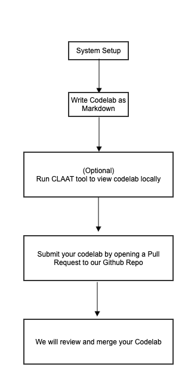

id: codelab-to-create-codelab
title: Template to Create Codelabs
summary: Learn how to contribute to QNX Codelabs
categories: codelabs, setup
tags: beginner
difficulty: 1
status: published
authors: Shweta Mazumder
feedback_link: https://github.com/qnx/codelabs/issues


# Create Your Own Codelab and Contribute to QNX

## Welcome
Duration: 2:00

### Overview
This codelab shows you **how to create your own Codelab** and contribute it to this site for the QNX community.

We use the open-source [Google Codelabs Tools](https://github.com/googlecodelabs/tools) to build the codelabs, but you really only need to know how to write Markdown files.

### Workflow
Below is the high level workflow we'll work through in this codelab:

 

Let's get started! Next, we'll install the pre-requisites to prepare your environment.

<!--
### Video
Video showing **how to create your own Codelab** and **contribute to QNX**
-->
---

## Set Up Environment
Duration: 5:00

### Pre-requisites

1. Get an IDE or editor. We recommend [VS Code](https://code.visualstudio.com/download).  
2. Be familiar with some GitHub basics, so you can contribute your codelab back to the community (See the [GitHub Learning Portal](https://learn.github.com/skills)).

That's it! Since the codelabs are just written as Markdown files, this is all you really need. Optionally though, you may wish to install Claat so you can render and preview your work locally.

---

### Build Claat from Source
This step is optional, but highly recommended so you can fully render and preview your codelab in your local environment.

1. [Install Go](https://go.dev/doc/install), which is needed to use Claat.
2. After the install, set these updated environment variables in your terminal session:

    ```bash
    # Install go globally as environment variable
    export PATH=$PATH:/usr/local/go/bin
    export GOPATH=$HOME/go
    export PATH=$PATH:$GOPATH/bin
    ```

3. We have taken Google's Open Source Claat Tool and customized it for QNX codelabs. So clone the repo from the QNX fork: https://github.com/qnx/tools:

    ```bash
    git clone https://github.com/qnx/tools.git
    ```

2. Navigate to the `claat` directory:

    ```bash
    cd tools/claat
    ```

3. Use `go` to build Claat:

    ```bash
    go install
    ```

4. Verify go and Claat are now working correctly in your terminal:
   ```bash
   go version
   claat --help
   ```

Your system should be ready to start writing codelabs!

---

## Guidelines for Creating Codelabs
Duration: 1:00

Follow these guidelines to write a high-quality codelab.

- Focus on one specific goal in each codelab. Separate multiple goals into different codelabs.
- Add an Introduction page describing the codelab's purpose and outcome.
- Include a System Set Up section or page for pre-requisites and information about any important resources.
- Use code snippets and videos where possible to help convey exact information.
- Break content into small, independent sections so it is easier to follow.
- Always create a GitHub fork or branch for your contributions.

---

## Set Up Repo for Codelab
Duration: 2:00

Now that you are ready to build a codelab, you nedd to fork and clone your own copy of the codelab repo.

1. Fork the [main QNX Codelabs repository](https://github.com/qnx/codelabs)

2. Clone your fork locally using SSH or HTTPS (or alternatively, the GitHub CLI):
    ```bash
    # Make sur to use the correct clone URL for your fork:
    git clone https://github.com/your-username/codelabs.git
    # OR
    git clone git@github.com:your-username/codelabs.git
    ```

3. It is helpful to to work on a new branch, therefore perhaps create a branch where you will commit and push your changes. When you're finished authoring, you'll use this branch to submit a Pull Request back to the QNX project.

    ```bash
    git checkout -b <name-of-your-codelab>
    ```

---

## Create a new Codelab
Duration: 3:00

This section explains how to create a new codelab.

Only work in the `markdown` folder under your created codelab repo's new directory. Ensure you do **not** make changes to other folders or files, so that your contribution is clean and doesn't interfere with other draft codelabs. Inconsistencies or changes to other files will unfortunately result in a rejected pull request.

1. Create a New Folder for your codelab at `~./markdown/<name-of-your-codelab>`:

    ```bash
    mkdir -p ./codelabs/markdown/<name-of-your-codelab>
    ```

2. Copy `markdown-template.md` into your newly created directory, from the `codelabs/ dir, to  ensure the required tags are included in hyour draft.

    The `id` tag must exactly match the `.md` filename for Claat to work correctly.

    ```bash

    id: name-of-your-codelab
    title: template to create codelabs
    summary: Learn how to add new Codelabs
    categories: codelabs, setup
    tags: beginner
    difficulty: 1
    status: published
    authors: Your Team
    feedback_link: https://github.com/qnx/codelabs/issues
    
    ```

3. Rename the markdown file as `<name-of-your-codelab>.md`

4. (Optional) Run `claat` to view your `<name-of-your-codelab>.md` file locally as HTML. Otherwise, skip to step 7.

    ```bash
    # cd out from ~./markdown/<name-of-your-codelab> dir to ~./codelabs

    claat export -f html -o docs ./markdown/<name-of-your-codelab>/<name-of-your-codelab>.md
    
    ```
5. You will see some output in the terminal and a new directory with the same codelab name will be created under `codelabs/docs`.


6. Now run the Claat server to view the HTML locally at `http://localhost:8000` from your `codelabs/docs/<name-of-your-codelab>` directory

    ```bash
    # cd to ./codelabs/markdown/<name-of-your-codelab>/
    
    claat serve <name-of-your-codelab>.md
    
    ```
7. Stage your changes to prepare for submitting a pull request (PR) back to the QNX source repo.

    ```bash
    # From the ~./codelabs/markdown/<name-of-your-codelab> directory

    git add .
    git commit -m "add comments for your commit"
    git push -u origin name-of-your-codelab
    
    ```

Congratulations! We will review and add your pull request soon. Thank you for contributing to QNX Codelabs!

---