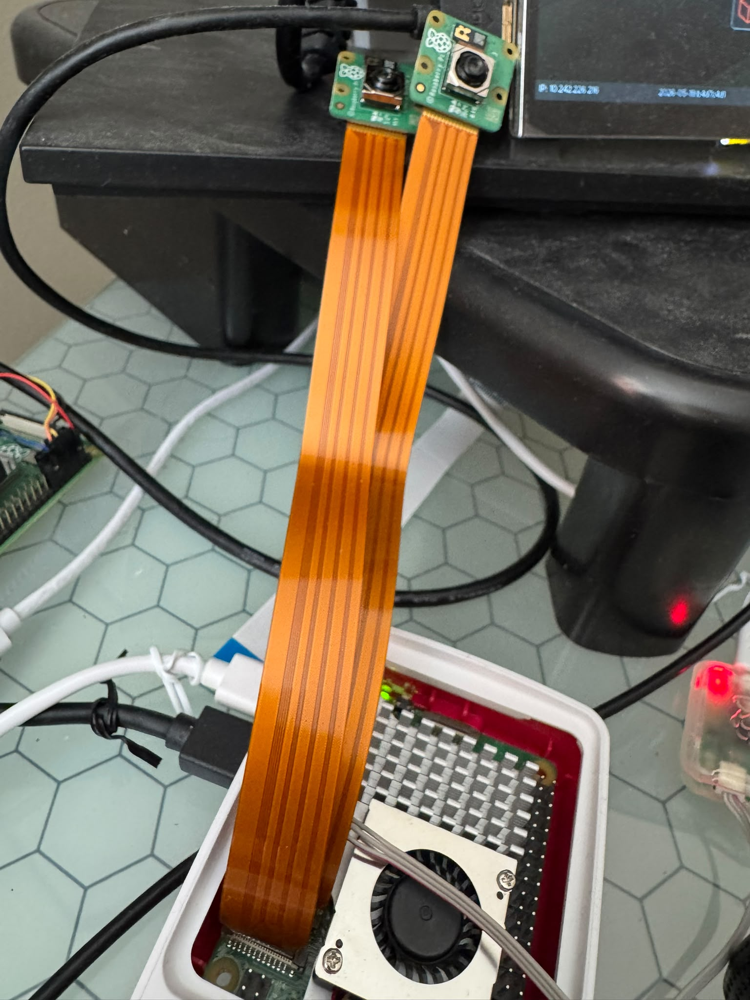
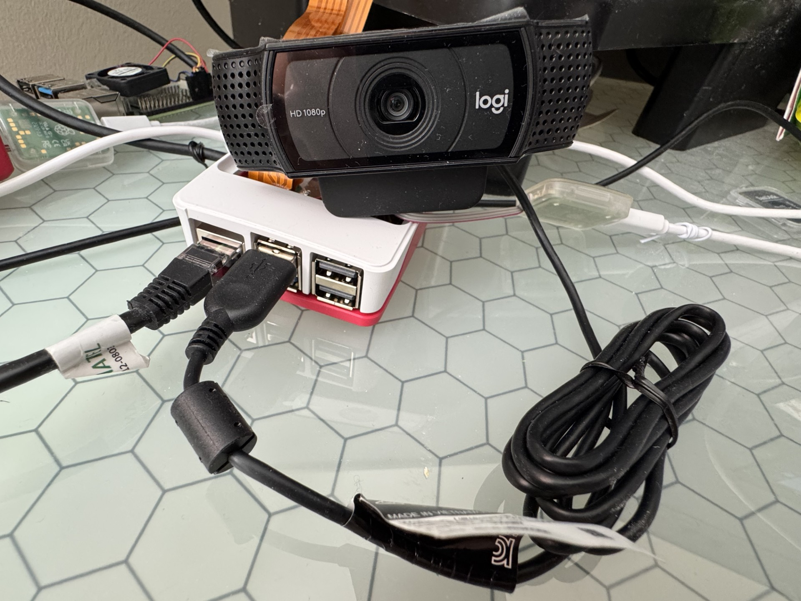
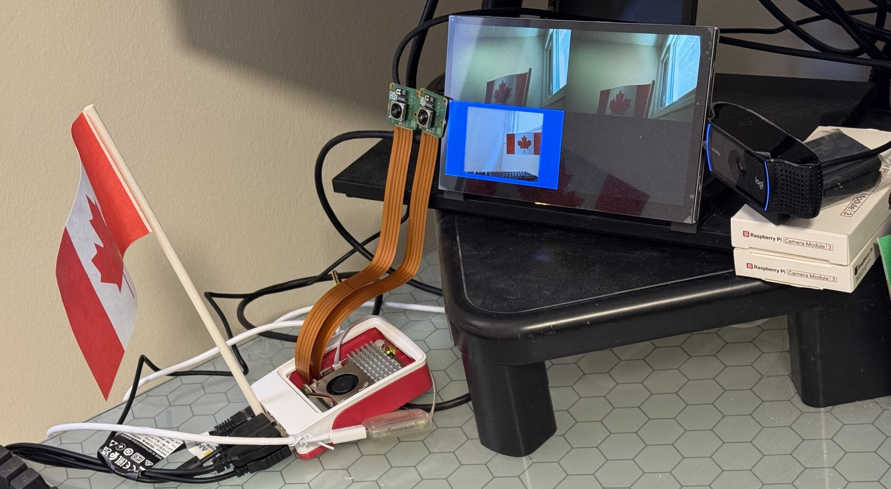

id: configure-multiple-camera-sources-on-RPI5
title: Codelabs to configure multiple camera sources on RPI5
summary: Learn how to configure multiple camera sources on RPI5
categories: codelabs, setup, qnx-sensor-framework
tags: beginner
difficulty: 1
status: published
authors: Terence Ang
feedback_link: https://github.com/qnx/codelabs/issues


# Configure multiple camera sources on Raspberry PI 5

## Introduction
This codelab describes how to configure multiple camera sources on the Raspberry Pi 5. The instructions provided enable support for multiple camera inputs.

## Prerequisites
### Hardware
- 1 x Raspberry PI 5
- 2 x Camera Module 3
- 1 x Logitech C920x (or C920)

### QuickStart Target Image (QSTI)
- On the host, launch QNX Software Center and install the QSTI image for QNX 8.0, for example:
com.qnx.qnx800.quickstart.rpi5/0.5.0.00319T202605190151L
- Use Raspberry Pi Imager or another imaging tool to write the image to the SD card.
- Insert the SD card into the Raspberry Pi 5 and plug in the power supply.

### Dependent packages
Install the following packages
```sh
sudo apk add \
    yaml \
    libturbojpeg \
    qnx-egl \
    qnx-gles \
    qnx-screen \
    qnx-devu-hcd-dwc3-xhci \
    qnx-sensor-framework-rpi-camera-ipa \
    qnx-io-usb-otg \
    qnx-usb \
    qnx-multimedia-framework \
    qnx-sensor-framework \
    qnx-sensor-framework-camera-imx708 \
    qnx-sensor-framework-rpi5 \
    qnx-sensor-framework-utils
```

## Hardware Configuration
### Connect two Camera Module 3 units to the DISP0 and DISP1 ports as follows:


### Connect Logitech C920x (or C920) to one of the USB ports as follows:


## Startup script configuration
### Enable 2 Camera Modules
To enable 2 camera modules, we need to
- Enable IRQ 11, 13, 47, 48 with `msix-rp1` and `gpio-rp1`
- Enable i2c4 and i2c6 with `i2c-dwc-rpi5`
- Enable `sensor` at startup with `rpi5_camera_module3.conf`


To achieve above,
- Login as `root`
```sh
sudo su -
```
- Backup `/usr/etc/startup/post_startup.sh`
```sh
cp -p /usr/etc/startup/post_startup.sh /usr/etc/startup/post_startup.sh.org
```
- apply the following patch, `post_startup.sh.diff`, and restart

```sh
cd /usr/etc/startup
patch -p1 -i post_startup.sh.diff
```

The patch, `post_startup.sh.diff`, is as follows:
```sh
diff --git a/post_startup.sh b/post_startup.sh
index eecdafa..6c0a345 100755
--- a/post_startup.sh
+++ b/post_startup.sh
@@ -141,7 +141,14 @@ io-snd -c /system/etc/system/config/sound/io_snd.conf
 echo '---> Initializing camera support...'
 # i2c6 is used by camera
 # Enable RP1 MSIX I2C6/MIPI0/MIPI1 interrupts
-msix-rp1 --mode=config 13lll,47,48
+msix-rp1 --mode=config 11lll,13lll,47,48
+
+gpio-rp1 set 40 a2 pu
+gpio-rp1 set 41 a2 pu
+/system/bin/i2c-dwc-rpi5 -p0x1f00080000 -c200000000 -q0xab --u4
+waitfor /dev/i2c4
+
+
 gpio-rp1 set 38 a3 pu
 gpio-rp1 set 39 a3 pu
 /system/bin/i2c-dwc-rpi5 -p0x1f00088000 -c200000000 -q0xad --u6
@@ -152,6 +159,7 @@ fi

 # Enable CSI2 PiSP Frontend
 gpio-rp1 set 34 op dh pd
+gpio-rp1 set 46 op dh pd

 if [ -d /dev/screen ]; then
     echo '---> Starting sensor framework...'
@@ -175,7 +183,7 @@ if [ -d /dev/screen ]; then
     #sensor -U 521:521 -r /data/share/sensor -c /system/etc/config/sensor/u3v_camera.conf

     # Simulator camera i.e. color bars
-    sensor -U 521:521 -b external -r /data/share/sensor -c /system/etc/config/sensor/sensor_demo.conf
+    #sensor -U 521:521 -b external -r /data/share/sensor -c /system/etc/config/sensor/sensor_demo.conf

     # Intel D435 depth camera - z16 depth map and ycbycr color image
     #sensor -U 521:521 -r /data/share/sensor -c /system/etc/config/sensor/d435_z16_ycbycr.conf
@@ -183,10 +191,16 @@ if [ -d /dev/screen ]; then
     # Intel D435 depth camera - rgb565 depth map image and ycbycr color image
     #sensor -U 521:521 -r /data/share/sensor -c /system/etc/config/sensor/d435_rgb565_ycbycr.conf

+    sensor -U 521:521 -b external -r /data/share/sensor -c /system/etc/config/sensor/rpi5_camera_module3.conf
+
     waitfor /dev/sensor/camera1
     if [ $? -ne 0 ]; then
         echo '---> waitfor /dev/sensor/camera1 failed.'
     fi
+    waitfor /dev/sensor/camera2
+    if [ $? -ne 0 ]; then
+        echo '---> waitfor /dev/sensor/camera2 failed.'
+    fi
 else
     echo '---> Error Screen not available.  Sensor framework will not be started.'
 fi
```

### Enable Logitech C920x (or C920) as the third camera
To enable Logitech C920x in addition to the 2 camera module 3,

- Duplicate `/usr/etc/config/sensor/rpi5_camera_module3.conf` to `/usr/etc/config/sensor/usb_and_cam3.conf`
```sh
cp /usr/etc/config/sensor/rpi5_camera_module3.conf /usr/etc/config/sensor/usb_and_cam3.conf
```

- apply the following patch, `usb_and_cam3.conf.diff`,
```sh
cd /usr/etc/config/sensor
patch -p1 -i usb_and_cam3.conf.diff
```

- The patch, `usb_and_cam3.conf.diff`, is as follows:
```sh
diff --git a/usb_and_cam3.conf b/usb_and_cam3.conf
index b693684..8e17101 100644
--- a/usb_and_cam3.conf
+++ b/usb_and_cam3.conf
@@ -27,6 +27,24 @@ begin SENSOR_UNIT_2
     algorithm_config = /usr/etc/config/sensor/rpi5_algorithm_imx708.json, imx708
 end SENSOR_UNIT_2

+begin SENSOR_UNIT_3
+    type = usb_camera
+    name = front-camera
+    position = 0, 0, 0
+    direction = 0, 0, 0
+    default_video_framerate = 30
+    address = /dev/usb/io-usb-otg, -1, -1, -1, -1
+end SENSOR_UNIT_3
+
 begin INTERIM_DATA_UNIT_1
     num_buffers = 5
     buffer_size = 8096
```

- Modify `/usr/etc/startup/post_startup.sh` to
  - point to `/usr/etc/config/sensor/usb_and_cam3.conf`
  - wait for `/dev/sensor/camera3`
```sh
...
    sensor -U 521:521 -b external -r /data/share/sensor -c /system/etc/config/sensor/usb_and_cam3.conf
...
     waitfor /dev/sensor/camera1
     if [ $? -ne 0 ]; then
         echo '---> waitfor /dev/sensor/camera1 failed.'
     fi
     waitfor /dev/sensor/camera2
     if [ $? -ne 0 ]; then
         echo '---> waitfor /dev/sensor/camera2 failed.'
     fi
     waitfor /dev/sensor/camera3
     if [ $? -ne 0 ]; then
         echo '---> waitfor /dev/sensor/camera3 failed.'
     fi
 else
...
```

## Validate Configuration

### Ensure login as root

```sh
[qnxuser@qnxpi ~]$ sudo su -
[sudo] password for qnxuser:
```

### Validate sensor service is up and running
run `pidin ar | grep sensor`

The output will be as follows:
```sh
[root@qnxpi ~]# pidin ar | grep sensor
  913444 sensor -U 521:521 -b external -r /data/share/sensor -c /system/etc/config/sensor/rpi5_camera_module3.conf
```

If Logitech C920x (or C920) was also enabled as the third camera,

The output will be as follows:
```sh
[root@qnxpi ~]# pidin ar | grep sensor
  913444 sensor -U 521:521 -b external -r /data/share/sensor -c /system/etc/config/sensor/usb_and_cam3.conf
```


### Validate that i2c are configured properly at `-q0xab` and `-q0xad`, with `i2c-dwc-rpi5`
```sh
[root@qnxpi ~]# pidin ar | grep i2c-dwc-rpi5
  671765 /system/bin/i2c-dwc-rpi5 -p0x1f00074000 -c200000000 -q0xa8
  856098 /system/bin/i2c-dwc-rpi5 -p0x1f00080000 -c200000000 -q0xab
  884771 /system/bin/i2c-dwc-rpi5 -p0x1f00088000 -c200000000 -q0xad
```

### Ensure camera sensors are enabled
run `ls -al /dev/sensor`

The output will be as follows:
```sh
[root@qnxpi ~]# ls -al /dev/sensor
total 0
-rw-rw----  1 521 sensor 0 1970-01-01 00:00 camera1
-rw-rw----  1 521 sensor 0 1970-01-01 00:00 camera2
-rw-rw----  1 521 sensor 0 1970-01-01 02:20 data1
-rw-rw----  1 521 sensor 0 1970-01-01 02:20 data2
```

If Logitech C920x (or C920) was also enabled as third camera

The output will be as follows:
```sh
[root@qnxpi ~]# ls -al /dev/sensor
total 0
-rw-rw----  1 521 sensor 0 1970-01-01 00:00 camera1
-rw-rw----  1 521 sensor 0 1970-01-01 00:00 camera2
-rw-rw----  1 521 sensor 0 1970-01-01 00:00 camera3
-rw-rw----  1 521 sensor 0 1970-01-01 02:20 data1
-rw-rw----  1 521 sensor 0 1970-01-01 02:20 data2
```

### Validate the IRQs are enabled for the 2 Camera Module 3
run `msix-rp1`

The output will be as follows:
```sh
[root@qnxpi ~]# msix-rp1
Interrupt Configuration and Status
...
  11 |             I2C4 | -EI | **-Ml | *l
...
  13 |             I2C6 | -EI | **-Ml | *l
...
  47 |            MIPI0 | -EI | ---Me | -e
  48 |            MIPI1 | -EI | ---Me | -e
...
```


## Launch The Cameras
### Run `camera_example3_viewfinder -u N`, where N is the camera number
```sh
[root@qnxpi ~]# camera_example3_viewfinder -u 1 &
[root@qnxpi ~]# camera_example3_viewfinder -u 2 &
```

If Logitech C920x (or C920) was also enabled as third camera, run following as well
```sh
[root@qnxpi ~]# camera_example3_viewfinder -u 3 &
```

### Switch between cameras
If a USB keyboard is attached to RPI5, you can press `Alt` + `Tab` to switch between the cameras.


### Multiplex the cameras
The cameras can be multiplexed at the same time using `camera_mux -n N`, where N is the total number of cameras to be multiplexed.

However, currently the process `fullscreen-winmgr` restricts on this.

We need to stop the `fullscreen-winmgr` service before multiplexing the camera streams.
```sh
slay fullscreen-winmgr
camera_mux -n 2
```

If Logitech C920x (or C920) was also enabled as a third camera, run
```sh
camera_mux -n 3
```

The following is the moment when three cameras are multipexed


## Troubleshooting
### Validate that the two Camera Module 3 units are detected
Run `slog2info -b sensor_service`
You will find similar output as follows:
```sh
...
Jan 01 00:00:11.249          sensor_service.913444                 info      0  int main(int, char**)(620): Initializing of platform completed
Jan 01 00:00:11.249          sensor_service.913444                debug      1  [ext]int getResolutions(platform_external_handle_t, sensor_unit_t, camera_frametype_t, int*, const camera_res_t**)(945): Camera 1: 2 resolutions for type 1
Jan 01 00:00:11.249          sensor_service.913444                debug      1  [ext]int getFramerates(platform_external_handle_t, sensor_unit_t, camera_res_t*, camera_frametype_t, int*, bool*, float*)(989): Camera 1: rates 1, type 1, resolution 2304 x 1296 maxmin 0
...
Jan 01 00:00:11.250          sensor_service.913444                debug      1  [ext]int getResolutions(platform_external_handle_t, sensor_unit_t, camera_frametype_t, int*, const camera_res_t**)(945): Camera 2: 2 resolutions for type 1
Jan 01 00:00:11.250          sensor_service.913444                debug      1  [ext]int getFramerates(platform_external_handle_t, sensor_unit_t, camera_res_t*, camera_frametype_t, int*, bool*, float*)(989): Camera 2: rates 1, type 1, resolution 2304 x 1296 maxmin 0
...

```
If the Camera Module 3 is not detected, inspect the ribbon cables to ensure they are firmly connected to the Raspberry Pi 5 ports.

### Validate that the Logitech camera is detected
Run `usb` or `usb -vvv` if more details are required.

You will find similar output as follows:
```sh
...
USB 1 (XHCI) v10.00, v1.01 DDK, v2.00 HCD, DLL: Active

Device Address             : 1
Vendor                     : 0x046d (Logitech)
Product                    : 0x08e5 (HD Pro Webcam C920)
Class                      : 0xef (Miscellaneous)
Subclass                   : 0x02
Protocol                   : 0x01
...
```
