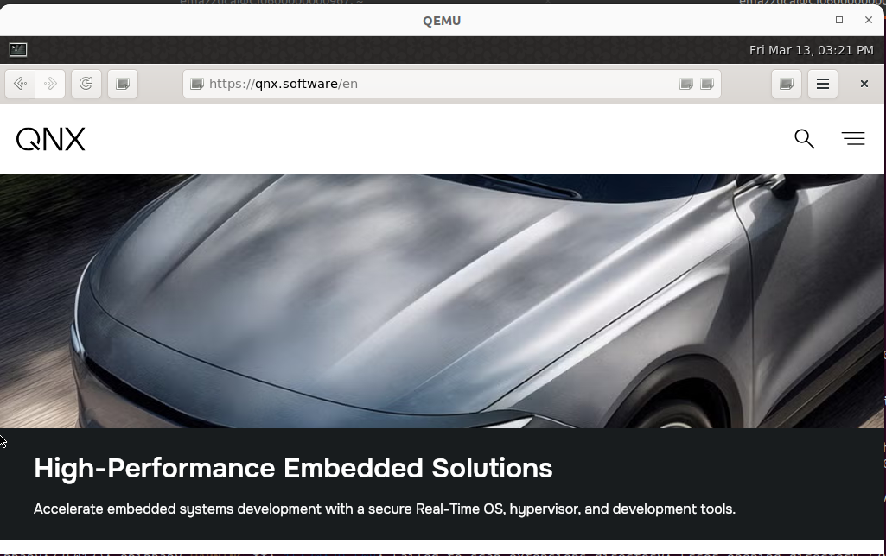

id: epiphany-standalone-qnx
title: Standalone Epiphany Browser on QNX
summary: Running the Epiphany web browser on a minimal QNX 8.0 image without the full desktop stack
categories: qnx, epiphany, webkit
tags: intermediate
difficulty: 3
status: published
authors: Elliott Mazzuca
feedback_link: https://github.com/qnx/codelabs/issues

# Standalone Epiphany Browser on QNX 8.0

## Introduction



One of the goals of the QNX porting team is to enable rich browser-based UI experiences on QNX targets without requiring the full QNX Developer Desktop. This codelab walks through running **Epiphany (GNOME Web)** — a WebKit2GTK-based browser — on a **minimal QNX 8.0 image** with no XFCE desktop stack.

The target use case is embedded platforms like the **Ezurio i.MX8**, where a customer may want a working browser without shipping a full desktop environment. This codelab proves the concept on QEMU x86_64 first.

**What you will learn:**

* How to build a minimal QNX 8.0 QEMU image using `qapkimgen`
* How to bootstrap APK on a fresh minimal image
* How to bring up the QNX graphics stack (Screen → Weston) on a minimal image
* How to configure mouse input on a minimal image without the full HID stack
* How to launch Epiphany with a full browser UI using `desktop-shell`

**Prerequisites:**

* A Linux host machine with QEMU and the QNX 8.0 SDP installed
* Access to the QNX APK package repository
* Familiarity with basic QNX concepts (Screen, APK, QEMU)

---

## How it works — Architecture Overview

Before diving into steps, it helps to understand what we're building and why each piece exists.

A standard QNX Developer Desktop image includes a full init system, XFCE desktop, and pre-configured graphics stack. On a minimal image, **none of that exists** — you get a kernel, a shell, and not much else. We need to build up the stack ourselves.

The layers, from bottom to top:

| **Layer** | **Component** | **What it does** |
| :--- | :--- | :--- |
| Hardware input | `io-hid` + `devh-ps2ser-vm` | Captures mouse and keyboard from QEMU's emulated PS/2 devices |
| Display driver | `drm-virtio` | Drives the virtio GPU exposed by QEMU |
| Display server | QNX Screen | Low-level window/surface manager. Everything graphical goes through Screen |
| Compositor | Weston | Wayland compositor. Manages windows, provides the desktop environment |
| Browser | Epiphany + WebKit2GTK | The browser itself. WebKit splits into multiple processes that communicate over dbus |

The key insight is **order matters**. Mouse input must be initialized before Screen starts, Screen must be running before Weston starts, and Weston and Epiphany must share a single dbus session for WebKit's inter-process communication to work.

---

## Phase 1 — Prepare config files on the host

We create all configuration files on the host machine before touching the QNX image. This is a hard rule: the minimal image has no `/tmp` or pipes at first boot, making it impossible to create multi-line files directly on the target.

Create a working directory:

```bash
mkdir -p ~/qnx-browser-setup
```

### `/bin/init` — the boot script

On the minimal image there is no init system yet (OpenRC is planned but not ready). The IFS bootloader checks for `/bin/init` on the real filesystem and runs it if found. This script is our hand-rolled replacement — it brings up every service the system needs before handing off to a login prompt.

It does three broad things:

1. **Core OS primitives** — pipe server, message queues, and a RAM-backed `/tmp`. These are things Linux provides automatically; on QNX they are separate servers that must be started explicitly. Without them, `sudo` fails, dbus fails, and nothing works.
2. **Networking** — socket stack, DHCP, and SSH. Gets you network access and lets you connect from a host terminal.
3. **Graphics stack in the correct order** — mouse driver first, then the DRM driver, then QNX Screen. Order is critical here; we confirmed this by reading `/bin/init` on the desktop image.

```bash
cat > ~/qnx-browser-setup/bin-init << 'EOF'
#!/usr/bin/bash

echo "FSEVMGR INIT"
on -p 98 /usr/bin/fsevmgr

echo "PIPE INIT"
on -p 98 /usr/bin/pipe
/ifs/usr/bin/waitfor /dev/pipe

echo "MQUEUE INIT"
on -p 98 /usr/bin/mqueue
/ifs/usr/bin/waitfor /dev/mqueue

echo "TMPFS INIT"
tmem=$(($(cat /proc/vm/stats | grep page_count | cut -d'=' -f2 | cut -d' ' -f1)))
tmpfs_size=$((tmem / 20 * 4096))
devb-ram ram capacity=1 blk ramdisk="$tmpfs_size"
/ifs/usr/bin/waitfor /dev/ram0
mkqnx6fs -q /dev/ram0
mount /dev/ram0 /tmp
chmod 1777 /tmp

echo "RANDOM INIT"
on -p 98 sh -c 'random -l devr-virtio.so'
/ifs/usr/bin/waitfor /dev/random

echo "SOCKET INIT"
on -p 98 sh -c 'io-sock -m phy -m pci -d vtnet_pci'
/ifs/usr/bin/waitfor /dev/socket

echo "DHCPCD INIT"
on -p 20 dhcpcd -bq

echo "SSHD INIT"
if ! [[ -f /etc/ssh/ssh_host_rsa_key ]]; then
    ssh-keygen -A
fi
on -p 20 /usr/bin/sshd

echo "IO-HID INIT"
io-hid -dps2ser-vm kbd:kbddev:vmware:mousedev
/ifs/usr/bin/waitfor /dev/io-hid/io-hid

echo "DRM INIT"
drm-virtio -u qnx &
sleep 2

echo "SCREEN INIT"
screen -c /usr/share/screen/graphics-virtio-virgl.conf -u qnx
/ifs/usr/bin/waitfor /dev/screen/command
echo "drop_privileges" > /dev/screen/command

mkdir -p /var/run/1000
chown 1000:1000 /var/run/1000
chmod 700 /var/run/1000

echo "LOGIN"
on -d -t /dev/ser1 sh -c '/ifs/usr/bin/reopen /dev/ser1 && while true; do login; sleep 1; done'
EOF
```

### `start-browser.sh` — the launch script

This is the single command you run after logging in. It starts Weston and Epiphany inside one shared dbus session. They must share a session because WebKit splits into multiple processes (UI, web, network) and uses dbus to coordinate between them — separate sessions causes the browser to open with a blank white screen and no error.

```bash
cat > ~/qnx-browser-setup/start-browser.sh << 'EOF'
#!/usr/bin/bash
dbus-run-session bash -c "
  export XDG_RUNTIME_DIR=/var/run/1000
  export XKB_CONFIG_ROOT=/usr/share/X11/xkb
  export XDG_DATA_DIRS=/usr/share
  export XDG_CACHE_HOME=/var/home/qnx/.cache
  export XDG_DATA_HOME=/var/home/qnx/.local/share
  export XDG_CONFIG_HOME=/var/home/qnx/.config
  export XDG_STATE_HOME=/var/home/qnx/.local/state
  export __GL_SHADER_CACHE=1
  export WAYLAND_DISPLAY=wayland-1
  weston --backend=qnx-screen-backend.so -c ~/.config/weston.ini &
  sleep 3
  epiphany https://example.com
"
EOF
```

### `graphics-virtio-virgl.conf` — the Screen config

Tells QNX Screen how to initialize the virtio GPU and what resolution to use. The QNX virtio WFD driver caps at **1024x600** regardless of what you request — so we set `video-mode` to match that reality. This must always match the `xres/yres` value in the QEMU launch command; if they differ, the SDL window is larger than QNX's output and you get black borders.

```bash
cat > ~/qnx-browser-setup/graphics-virtio-virgl.conf << 'EOF'
begin khronos

  begin egl display 1
    egl-dlls = virtio_dri.so EGL-mesa.so
    glesv2-dlls = virtio_dri.so GLESv2-mesa.so
    gpu-dlls = virtio_dri.so gpu_virtio.so
    vk-icds = virtio_icd.json
  end egl display

  explicit-screen-buffer-coherency=true

  begin wfd device 1
    wfd-dlls = libwfdcfg-virtio.so libWFDvirtio.so
  end wfd device

end khronos

begin winmgr

  begin globals
    blit-config = gles2blt
    alloc-config = alloc-virtio-virgl
  end globals

  begin display 1
    video-mode = 1024 x 600 @ 60
    defer-framebuffer-creation = false
    force-composition = true
    allow-bypass = false
  end display

  begin class framebuffer-1
    display = 1
    format = rgbx8888
    usage = gles2blt
    buffer-count = 4
  end class

end winmgr
EOF
```

### `weston.ini` — the Weston config

Selects `desktop-shell.so` as the Weston shell plugin, which gives Epiphany a normal windowed environment with its toolbar and address bar visible. The alternative `kiosk-shell.so` forces fullscreen and hides the entire browser UI — useful for locked-down customer delivery, but not for general use.

```bash
cat > ~/qnx-browser-setup/weston.ini << 'EOF'
[core]
shell=desktop-shell.so
EOF
```

---

## Phase 2 — Create the QEMU launch script

Create `~/qapkimgen/run_browser.sh`:

```bash
cat > ~/qapkimgen/run_browser.sh << 'EOF'
qemu-system-x86_64 \
    -smp $(nproc) \
    --enable-kvm \
    --cpu host,host-phys-bits-limit=39 \
    -machine pc \
    -m 16G \
    -drive if=pflash,format=raw,readonly=on,file=/usr/share/OVMF/OVMF_CODE.fd \
    -drive if=pflash,format=raw,file=./OVMF_VARS.fd \
    -drive file=./out/x86_64-qemu-uefi-<date>.img,if=virtio,id=drv0,driver=raw \
    -netdev user,id=net0,hostfwd=tcp::2222-:22 \
    -device virtio-net-pci,netdev=net0 \
    -object rng-random,filename=/dev/urandom,id=rng0 -device virtio-rng-pci,rng=rng0 \
    -serial mon:stdio \
    -vga none \
    -device virtio-vga-gl,xres=1024,yres=600 \
    -display sdl,gl=on
EOF
chmod +x ~/qapkimgen/run_browser.sh
```

A few important notes about this command:

* **`xres=1024,yres=600`** must match `video-mode` in the screen config. Both must always be changed together.
* **No `-device virtio-mouse-pci` or `-device virtio-keyboard-pci`** — the mouse driver uses QEMU's implicit PS/2 emulation from `-machine pc`. Adding virtio input devices on top breaks mouse input.
* **Split OVMF** (`OVMF_CODE.fd` read-only + separate `OVMF_VARS.fd`) prevents QEMU from corrupting the EFI NVRAM when the launch command changes. If you ever see a PXE boot loop, reset with: `cp /usr/share/OVMF/OVMF_VARS.fd ./OVMF_VARS.fd`

---

## Phase 3 — Build the minimal image

```bash
cd ~/qapkimgen
source ~/qnx800/qnxsdp-env.sh
export LD_LIBRARY_PATH=$HOME/.local/lib/x86_64-linux-gnu:$LD_LIBRARY_PATH
./qapkimgen ./presets/x86_64-qemu-uefi.preset
```

Once built, set up OVMF and launch:

```bash
cp /usr/share/OVMF/OVMF_VARS.fd ./OVMF_VARS.fd
./run_browser.sh
```

Update the image filename in `run_browser.sh` to match the output file from `qapkimgen`.

Log in on the serial console with username `qnx`.

---

## Phase 4 — Bootstrap APK

The minimal image has no certificate trust store, so APK cannot verify HTTPS connections to the package repositories. We fix this using a utility bundled in the image build artifacts — no manual certificate copying required.

**On the host:**

```bash
scp -P 2222 ~/qapkimgen/tmp/x86_64-qemu-uefi/apkroot/usr/bin/update-ca-trust qnx@localhost:/tmp
```

**On the target:**

```bash
sudo cp /tmp/update-ca-trust /usr/bin/
sudo /usr/bin/update-ca-trust extract --init
sudo apk update
```

---

## Phase 5 — Install packages

```bash
sudo apk add \
    lz4-libs \
    epiphany \
    font-dejavu \
    weston \
    weston-backend-qnx-screen \
    weston-shell-desktop \
    qnx-screen-virtio \
    qnx-hid \
    qnx-devh \
    qnx-devh-vmmouse \
    dbus
```

Two packages are easy to miss and cause confusing silent failures:

* **`font-dejavu`** — Without fonts installed, WebKit renders a completely blank white page with no error message. It looks identical to a crash.
* **`weston-shell-desktop`** — A separate package from Weston itself. Without it, the only available shell is `kiosk-shell`, which hides Epiphany's entire toolbar and UI.

---

## Phase 6 — Transfer and install config files

Transfer all config files in one scp command:

```bash
scp -P 2222 \
    ~/qnx-browser-setup/bin-init \
    ~/qnx-browser-setup/start-browser.sh \
    ~/qnx-browser-setup/graphics-virtio-virgl.conf \
    ~/qnx-browser-setup/weston.ini \
    qnx@localhost:/var/home/qnx/
```

Then install them on the target:

```bash
sudo cp /var/home/qnx/bin-init /bin/init
sudo chmod +x /bin/init

sudo cp /var/home/qnx/start-browser.sh /usr/bin/start-browser.sh
sudo chmod +x /usr/bin/start-browser.sh

sudo mkdir -p /usr/share/screen
sudo cp /var/home/qnx/graphics-virtio-virgl.conf /usr/share/screen/graphics-virtio-virgl.conf

mkdir -p ~/.config
cp /var/home/qnx/weston.ini ~/.config/weston.ini
```

---

## Phase 7 — Reboot and launch

Reboot the image:

```bash
sudo shutdown
```

Watch the serial console during boot. You should see each INIT step print in sequence:

```
FSEVMGR INIT
PIPE INIT
MQUEUE INIT
TMPFS INIT
RANDOM INIT
SOCKET INIT
DHCPCD INIT
SSHD INIT
IO-HID INIT
DRM INIT
SCREEN INIT
LOGIN
```

Once you see the login prompt, log in and run:

```bash
start-browser.sh
```

Epiphany will launch with a full browser UI — address bar, navigation buttons, and working mouse input.

---

## Troubleshooting

| **Symptom** | **Cause** | **Fix** |
| :--- | :--- | :--- |
| `dbus-run-session: failed to create pipe` | `/dev/pipe` not running — `/bin/init` failed partway through | Check serial console for last INIT line printed |
| `fatal: failed to create compositor backend` | QNX Screen not running | Run `pidin \| grep screen` to confirm; check `/bin/init` ran fully |
| `fatal: XDG_RUNTIME_DIR is not a directory` | `/var/run/1000` doesn't exist — `/bin/init` didn't finish | Check serial console |
| Black borders around desktop | `xres/yres` and `video-mode` don't match | Both must be `1024x600` — change together |
| Browser toolbar missing | Wrong Weston shell, or Epiphany saved fullscreen state | Verify `weston.ini` has `shell=desktop-shell.so`; clear `~/.local/share/epiphany/` and `~/.config/epiphany/` |
| Mouse not working | Virtio mouse device in QEMU, or io-hid not started before Screen | Remove `-device virtio-mouse-pci` from QEMU launch; check `pidin \| grep io-hid` shows 8 threads with 2 INTR threads |
| `sudo: unable to allocate memory` | `/tmp` not mounted — `/bin/init` failed before TMPFS step | Cannot fix on target without SSH; mount image on host to repair `/bin/init` |

---

## Summary

You have successfully deployed a standalone Epiphany browser on a minimal QNX 8.0 image. The key takeaways from this work:

* The QNX graphics and input stack can be brought up manually without a full desktop environment
* Service startup order matters — mouse input before display server, display server before compositor
* WebKit requires a shared dbus session between all its processes and the compositor
* Multi-line config files must always be created on the host and transferred via scp — never written directly on a minimal target
