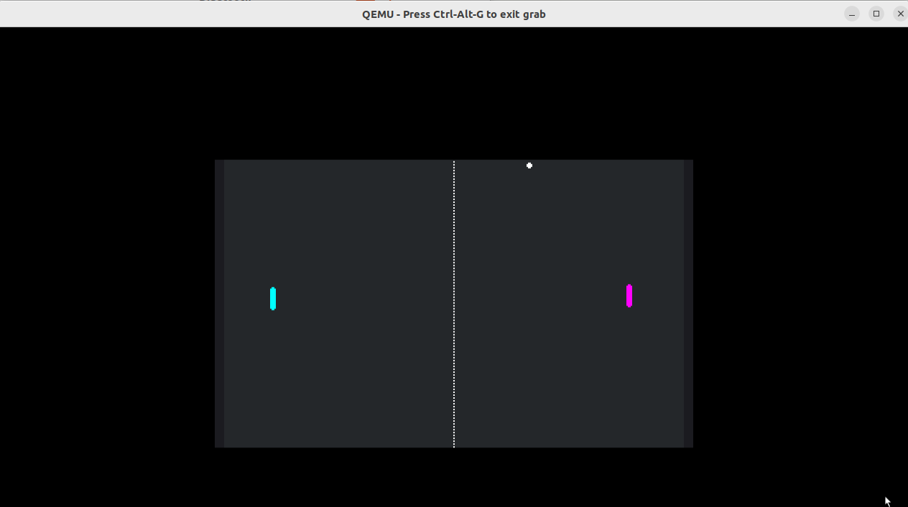

id: godot-codelab
title: Godot on QNX
summary: Running Pong with Godot on QNX
categories: qnx, godot
tags: beginner
difficulty: 1
status: published
authors: Yun Lee
feedback_link: https://github.com/qnx/codelabs/issues


# Running Pong with Godot on QNX
using QNX

## Introduction
 

What you will learn:
* How to clone a Godot project for QNX.
* How to install the Godot templates on a QNX target.
* How to launch a Godot game using the command line.

Prerequisites:
* A host machine (Linux, macOS, or Windows) with `git` installed.
* A target running [**QNX Developer Desktop**](https://www.qnx.com/developers/docs/qnxeverywhere/com.qnx.doc.qdd/topic/about.html) (QEMU VM, Raspberry Pi 4, or Raspberry Pi 5).
* Network connectivity between the host and the target.

---

## Prepare the Project (Host Machine)
Because this specific project is set up for cross-compilation environments, we will first clone it on your development host and then package it for the target.

1.  **Clone the repository:**
    ```sh
    git clone https://github.com/yulee-qnx/pong-qdd/
    ```

2.  **Zip the project:**
    Navigate to the directory and compress the folder to make transferring it easier.
    ```sh
    zip -r pong-qdd.zip pong-qdd
    ```

---

## Transfer to QNX Target
You need to move the project file from your host to the QNX Developer Desktop.

1.  **Find your Target IP:**
    On your QNX terminal, run:
    ```sh
    ifconfig
    ```

2.  **Secure Copy (SCP) the file:**
    From your **host machine**, run (replace the IP with your target's actual IP):
    ```sh
    scp pong-qdd.zip qnxuser@192.168.122.242:/data/home/qnxuser
    ```

3.  **Unzip on the Target:**
    Switch back to your **QNX target terminal** and run:
    ```sh
    unzip pong-qdd.zip
    ```

---

## Install Godot on QNX
The Godot engine is available via the [QNX Open Source Ports](https://oss.qnx.com/). Ensure your target has internet access to fetch the packages.

1.  **Search for available templates:**
    ```sh
    sudo apk search godot-templates
    ```

2.  **Install the templates:**
    ```sh
    sudo apk add godot-templates
    ```

---

## Launch the Game
Now that the engine is installed and the project files are present, you can launch the game using the rendering driver compatible with QNX Screen.

1.  **Run the Godot binary:**
    From the QNX terminal, execute:
    ```sh
    godot-template-release --path pong-qdd --rendering-driver opengl3_es
    ```

Game Controls
* **Player 1:** `W` (Up), `S` (Down)
* **Player 2:** `Up Arrow` (Up), `Down Arrow` (Down)
* **Exit:** `ESC` (Initiates a proper shutdown sequence)

---

## Technical Notes & Limitations
When developing with Godot on QNX, keep the following in mind:

| Feature | Support Level | Note |
| :--- | :--- | :--- |
| **Windowing** | QNX Screen | Wayland is not currently supported for this port. |
| **2D Graphics** | High | Excellent for HMI and UI visualizations. |
| **3D Graphics** | Basic | Optimized assets required; avoid heavy GPU effects. |
| **Audio** | Functional | Best supported on Raspberry Pi 4/5 environments. |

---

## Summary
You have successfully deployed a Godot game to QNX! This workflow opens the door for high-quality graphical interfaces and visualizations on a hard real-time operating system.

**Next Steps:**
* Explore the source code in the `pong-qdd` folder.
* Try modifying the physics logic and re-running the game on your target.

