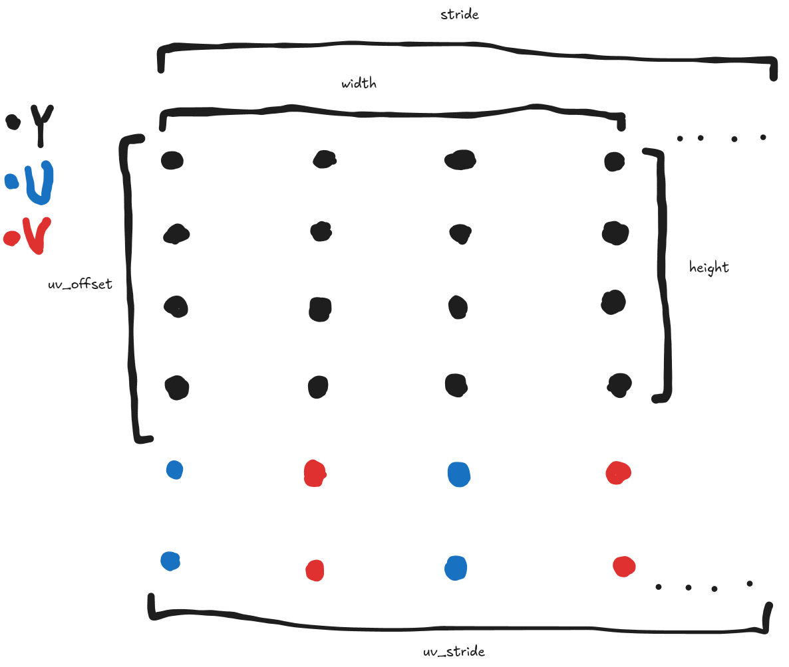

id: mediapipe-camera-sample
title: MediaPipe Camera Sample
summary: Write a camera application with MediaPipe and native QNX APIs
categories: qnx, mediapipe, qnx-sensor-framework, AI, camera
tags: advanced
difficulty: 5
status: published
authors: Ethan Leir
feedback_link: https://github.com/qnx/codelabs/issues


# MediaPipe Camera Sample

## Welcome
Duration: 1:00

MediaPipe is a unified set of AI solutions, which is designed so that you can
easily deploy it for edge use cases. You can find the most information about it
from [Google's own product documentation](https://developers.google.com/edge/mediapipe/solutions/guide).

The purpose of this guide is to explain how you can get a MediaPipe
application running on QNX through the lens of its samples, not to explain
MediaPipe itself. You should refer to the official documentation to learn all
the specifics of the mediapipe APIs.

---

## Set Up Environment
Duration: 1:00

> aside positive
>
> To follow these exact instructions for sensor framework, you will need a [Raspberry Pi 5](https://www.raspberrypi.com/products/raspberry-pi-5/) with a [Camera Module 3](https://www.raspberrypi.com/products/camera-module-3/).

Get started on the [QNX 8.0 Self-hosted Developer Desktop](https://www.qnx.com/developers/docs/qnxeverywhere/com.qnx.doc.qdd/topic/about.html).

Install the required dependencies:
```bash
sudo apk add bazel6 cmake ninja opencv-dev
```

---

## Get the Workspace Ready
Duration: 4:00

Start by cloning MediaPipe,
```bash
git clone https://github.com/qnx-ports/mediapipe.git --branch qnx-v0.10.26
cd mediapipe
```

Then, build MediaPipe's QNX examples for cpu:
```bash
./build_qnx_examples.sh
```

To build an individual example for gpu you can run the following command after
the above script:
```bash
# bazeltarget=...
bazel build -c opt \
   --action_env=PYTHON_BIN_PATH=/usr/bin/python3 \
   --repo_env=BAZEL_CXXOPTS=-std=c++17 \
   --override_repository=python=./python \
   --override_repository=python_qnx=./python_qnx \
   --extra_toolchains=@python_qnx//:qnx_py_toolchain \
   --extra_toolchains=@python_qnx//:qnx_py_toolchain2 \
   --extra_toolchains=@python_qnx//:qnx_py_cc_toolchain \
   --extra_toolchains=//cpp_qnx:qnx_cc_toolchain_x64 \
   --extra_toolchains=//cpp_qnx:qnx_cc_toolchain_arm64 \
   --extra_toolchains=//buildbase_qnx:qnx_cmake_toolchain \
   --extra_toolchains=//buildbase_qnx:qnx_ninja_toolchain \
   --copt=-DTFLITE_GPU_EXTRA_GLES_DEPS \
   --copt=-DMEDIAPIPE_OMIT_EGL_WINDOW_BIT \
   --copt=-DMESA_EGL_NO_X11_HEADERS \
   --copt=-DEGL_NO_X11 \
   ${bazeltarget}
```

Finally, run the example:
```bash
./bazel-bin/mediapipe/examples/qnx/face_detection/face_detection_cpu \
    --calculator_graph_config_file=./mediapipe/graphs/face_detection/face_detection_desktop_live.pbtxt
```
You can find the expected command line arguments in
[their respective BUILD files](https://github.com/qnx-ports/mediapipe/blob/qnx-v0.10.26/mediapipe/examples/qnx/face_detection/BUILD).

And that's it!

## Overview
Duration: 2:00

The QNX examples reside under `mediapipe/examples/qnx`. All of them rely on the
common `demo_run_graph_main.cc` and `demo_run_graph_main_gpu.cc`, which
themselves came from the examples for Linux. Most of the QNX-specific code lives
in the files `qnx_defs.cc` and `qnx_defs.h`. The QNX code contains the following
components that we will discuss individually: the camera sink, the window, and
the renderer.

MediaPipe is designed to handle conversions to/from `cv::Mat`, so the QNX
components will primarily need to accept `cv::Mat` as input and output.
Thankfully, OpenCV provides a suite of helpers to make video format conversions
trivial, which we will touch on in the following section.

## libcamapi Camera Sink
Duration: 30:00

> aside positive
>
> Note: Throughout this section I will provide links to the 7.1 libcamapi docs, however the most up-to-date and extensive source of information are the libcamapi headers under `/usr/include/camera` on the target.

The purpose of this component is to provide a way to fetch data from the camera
viewfinder running in a separate thread following [the producer/consumer pattern](https://en.wikipedia.org/wiki/Producer%E2%80%93consumer_problem).

This is similar to the [camera_example1_callback](https://gitlab.com/qnx/projects/camera-projects/applications/camera_example1_callback)
and the [AI Camera App](https://gitlab.com/qnx/projects/ai-camera-app).

We start with the basic boilerplate for a function to initialize a camera sink:
```c++
typedef struct mp_camera_info {
  // ...
} mp_camera_info_t;

absl::Status InitCameraSink(
  mp_camera_info_t &ci,
  const camera_unit_t unit,
  const bool save_video) {
  // ...
}
```
Which we will fill out as we go.

The very first thing that you need to work with libcamapi is a camera unit:

```c++
typedef struct mp_camera_info {
  camera_unit_t unit;
  // ...
} mp_camera_info_t;
```

But what is a camera unit? Running the following command:

```bash
$ sudo pidin ar | grep "sensor"
  860196 sensor -U 521:521 -b external -r /data/share/sensor -c /system/etc/config/sensor/sensor_demo.conf
 1204266 grep --color=auto sensor
```
You will see that when the `sensor` service was started, it was provided a
path to a configuration file with its `-c` flag. Opening up this configuration
file we see the contents:
```
begin SENSOR_GLOBAL
    external_platform_library_path = libsensor_platform_broadcom_rpi5.so
    external_platform_library_variant = PLATFORM_VARIANT_BCM2712
end SENSOR_GLOBAL

begin SENSOR_UNIT_1
    type = simulator_camera
    name = front
    position = 0, 0, 0
    direction = 0, 0, 0
    default_video_resolution = 1280, 720
    default_video_format = ycbycr
    num_user_buffers = 4
end SENSOR_UNIT_1
```
The important thing here is the field starting with `begin SENSOR_UNIT_1`.
This is your camera unit, which has the value 1 when interpreted as a literal.
Another thing you will notice is that it explicitly states some properties, most
notably a `default_video_format`, which is one of the formats we will need to
handle in our code, but more on that later.

This default configuration exists to give you an output of coloured bars if you
have no physical camera. But we have a Camera Module 3, so we need to point
sensor service at a different configuration. You will find that the
`/system/etc/config/sensor` directory contains configurations for various
cameras. We care about `/system/etc/config/sensor/camera_module3.conf`:
```
begin SENSOR_GLOBAL
    external_platform_library_path = libsensor_platform_broadcom_rpi5.so
    external_platform_library_variant = PLATFORM_VARIANT_BCM2712
end SENSOR_GLOBAL

begin SENSOR_UNIT_1
    type = external_camera
    name = imx708
    address = /system/lib/libimx708_external_camera.so,1
    use_hardware_capture = true
    i2c_path = /dev/i2c6
    default_video_format = nv12
end SENSOR_UNIT_1

begin INTERIM_DATA_UNIT_1
    num_buffers = 5
    buffer_size = 8096
    queue_depth = 1
    data_format = SENSOR_FORMAT_ISP_TUNING_REQUEST
    name = tuning_requests
end INTERIM_DATA_UNIT_1

begin ISP_TUNING_1
    request_interim_data_unit = INTERIM_DATA_UNIT_1
    sensor_units = SENSOR_UNIT_1
end ISP_TUNING_1
```
Note down that the camera unit here still has the literal value 1, and the video
format is nv12.

To point sensor service at the new config, we need restart the sensor service
using the PID that we got from the above `pidin` command:
```bash
sudo slay 860196
sudo sensor -U 521:521 -b external -r /data/share/sensor -c /system/etc/config/sensor/camera_module3.conf
```

Now, we need some way for the user to choose which camera unit to use as input
to the program. [Abseil Flags](https://abseil.io/docs/cpp/guides/flags) provides
convenient helpers for this:
```c++
ABSL_FLAG(long, camera_unit, (long)CAMERA_UNIT_INVALID,
          "The camera unit to open."
          "Set in a .conf file passed to sensor's -c argument at boot.");
```
We create a `--camera_unit` flag which accepts a `long` value, defaulting to
`CAMERA_UNIT_INVALID`.

Later on, we populate the local variable, `camera_unit_long`, with the value
stored in this flag inside the `RunMPPGraph()` method:
```c++
const long camera_unit_long = absl::GetFlag(FLAGS_camera_unit);

ABSL_LOG(INFO) << "Initialize the camera or load the video.";
mp_camera_info_t ci = {};
MP_RETURN_IF_ERROR(InitCameraSink(ci, (camera_unit_t)camera_unit_long, save_video));
```

You'll notice that the default camera unit is an invalid value. Typically,
across our sensor samples, not choosing a camera unit is considered a fatal
error. When writing this, I chose to be more permissive, and allow users to
enter nothing to indicate the "preferred" camera unit. But, you'll notice that
sensor framework doesn't have a concept of a "preferred" camera unit. Instead,
we're going to add some code to assume what you want is the first available
camera unit, and output a warning in case that isn't what you want. You'll find
that in a lot of the configurations that come with the QNX Developer Desktop,
there is only one camera unit, so this is a safe assumption to make.
```c++
std::vector<camera_unit_t> QueryCameraUnits() {
  std::vector<camera_unit_t> result;
  unsigned int num_units;
  int ret;

  ret = camera_get_supported_cameras(0, &num_units, nullptr);
  if (ret != CAMERA_EOK) {
    ABSL_LOG(ERROR) << "Failed to query camera units. "
      << "'camera_get_supported_cameras' returned: " << ret;
    return std::vector<camera_unit_t>();
  }

  result.resize(num_units);
  ret = camera_get_supported_cameras(num_units, &num_units, result.data());
  if (ret != CAMERA_EOK) {
    ABSL_LOG(ERROR) << "Failed to query camera units. "
      << "'camera_get_supported_cameras' returned: " << ret;
    return std::vector<camera_unit_t>();
  }

  return result;
}

absl::Status InitCameraSink(
  mp_camera_info_t &ci,
  const camera_unit_t unit,
  const bool save_video) {
  std::vector<camera_unit_t> units;
  absl::Status ret = absl::OkStatus();

  // Set default values.
  ci.unit = CAMERA_UNIT_INVALID;

  if (unit == CAMERA_UNIT_INVALID) {
    ABSL_LOG(WARNING) << "No camera unit was specified. Falling back to first "
      << "available camera unit.";
  } else if ((unit <= CAMERA_UNIT_NONE) || (unit >= CAMERA_UNIT_NUM_UNITS)) {
    ABSL_LOG(WARNING) << "The specified camera unit is invalid. Falling back to "
      << "first available camera unit.";
    ci.unit = CAMERA_UNIT_INVALID;
  } else {
    ci.unit = unit;
  }

  if (ci.unit == CAMERA_UNIT_INVALID) {
    units = QueryCameraUnits();
    if (units.empty()) {
      ABSL_LOG(ERROR) << "Failed to find any camera units.";
      ret = absl::UnknownError("Failed to find any camera units.");
      goto failure;
    }
    ci.unit = units[0];
  }

  // ...
}
```

Now, we need to open this camera unit, receiving a handle to that we can use in
subsequent calls to operate on it:
```c++
typedef struct mp_camera_info {
  camera_unit_t unit;
  camera_handle_t handle;
  // ...
} mp_camera_info_t;

absl::Status InitCameraSink(
  mp_camera_info_t &ci,
  const camera_unit_t unit,
  const bool save_video) {
  std::vector<camera_unit_t> units;
  int cam_ret;
  absl::Status ret = absl::OkStatus();

  // Set default values.
  ci.handle = static_cast<camera_handle_t>(-1);
  ci.unit = CAMERA_UNIT_INVALID;

  // ...

  cam_ret = camera_open(ci.unit, CAMERA_MODE_RO | CAMERA_MODE_ROLL | CAMERA_MODE_PWRITE, &ci.handle);
  if (cam_ret != CAMERA_EOK) {
    ABSL_LOG(ERROR) << "Failed to open camera. 'camera_open' returned error "
      << cam_ret << " (" << strerror(cam_ret) << ").";
    ret = absl::ErrnoToStatus(cam_ret, "Failed to open camera.");
    goto failure;
  }

  // ...
}
```
In this call to [camera_open()](https://www.qnx.com/developers/docs/7.1/com.qnx.doc.camera/topic/camera_open.html)
we pass `CAMERA_MODE_RO | CAMERA_MODE_ROLL | CAMERA_MODE_PWRITE` to signify that
we want:
- Read and write access to the camera's configuration,
- Read access to the camera's imaging datapath, and
- Access to the camera roll

This `camera_open()` call does not yet start the camera. We will touch on that
in a moment.

We saw earlier that we need to support nv12 in our code to be able to actually
interpret the data coming from the camera roll, but first we should sanitize the
input to make sure that the video format we're getting is actually one of those
types we do support:
```c++
absl::Status InitCameraSink(
  mp_camera_info_t &ci,
  const camera_unit_t unit,
  const bool save_video) {
  std::vector<camera_unit_t> units;
  camera_frametype_t frametype = CAMERA_FRAMETYPE_UNSPECIFIED;
  int cam_ret;
  absl::Status ret = absl::OkStatus();

  // Set default values.
  ci.handle = static_cast<camera_handle_t>(-1);
  ci.unit = CAMERA_UNIT_INVALID;

  // ...

  cam_ret = camera_get_vf_property(ci.handle, CAMERA_IMGPROP_FORMAT, &frametype);
  if (cam_ret != CAMERA_EOK) {
    ABSL_LOG(ERROR) << "Failed to set CAMERA_IMGPROP_FORMAT property. "
      << "'camera_set_vf_property' returned error " << cam_ret << " ("
      << strerror(cam_ret) << ").";
    ret = absl::ErrnoToStatus(cam_ret, "Failed to set camera property.");
    goto failure;
  }
  switch(frametype) {
  case CAMERA_FRAMETYPE_NV12:
  // ...
    break;
  default:
    ABSL_LOG(ERROR) << "The configured frametype is not supported.";
    ret = absl::UnknownError("The configured frametype is not supported.");
    goto failure;
    break;
  }

  // ...
}
```
You'll notice that we're not tracking `frametype` inside of the
`mp_camera_info_t` struct. This is because the data packet that we will get from
the viewfinder later on already contains this information, alongside other
important details like the height and width.

The last thing we need to do is set the behaviour we expect from the camera
roll:
```c++
typedef struct mp_camera_info {
  camera_unit_t unit;
  camera_handle_t handle;
  double framerate;
  // ...
} mp_camera_info_t;

absl::Status InitCameraSink(
  mp_camera_info_t &ci,
  const camera_unit_t unit,
  const bool save_video) {
  std::vector<camera_unit_t> units;
  camera_frametype_t frametype = CAMERA_FRAMETYPE_UNSPECIFIED;
  int cam_ret;
  absl::Status ret = absl::OkStatus();

  // Set default values.
  ci.handle = static_cast<camera_handle_t>(-1);
  ci.unit = CAMERA_UNIT_INVALID;

  // ...

  // Don't create a window automatically.
  cam_ret = camera_set_vf_property(ci.handle, CAMERA_IMGPROP_CREATEWINDOW, false);
  if (cam_ret != CAMERA_EOK) {
    ABSL_LOG(ERROR) << "Failed to set CAMERA_IMGPROP_CREATEWINDOW property. "
      << "'camera_set_vf_property' returned error " << cam_ret << " ("
      << strerror(cam_ret) << ").";
    ret = absl::ErrnoToStatus(cam_ret, "Failed to set camera property.");
    goto failure;
  }

  if (!save_video) {
    // A camera unit can just be a video, which does not allow setting framerate
    // or changing frame dimensions. So we treat these as suggestions instead.
    ci.framerate = 30.0;
    cam_ret = camera_set_vf_property(ci.handle, CAMERA_IMGPROP_FRAMERATE, ci.framerate);
    if (cam_ret != CAMERA_EOK) {
      camera_get_vf_property(ci.handle, CAMERA_IMGPROP_FRAMERATE, &ci.framerate);
    }

    camera_set_vf_property(ci.handle, CAMERA_IMGPROP_WIDTH, 640);

    camera_set_vf_property(ci.handle, CAMERA_IMGPROP_HEIGHT, 480);
  } else {
    cam_ret = camera_get_vf_property(ci.handle, CAMERA_IMGPROP_FRAMERATE, &ci.framerate);
    if (cam_ret != CAMERA_EOK) {
      ABSL_LOG(ERROR) << "Failed to get CAMERA_IMGPROP_FRAMERATE property. "
        << "'camera_get_vf_property' returned error " << cam_ret << " ("
        << strerror(cam_ret) << ").";
      ret = absl::ErrnoToStatus(cam_ret, "Failed to get camera property.");
      goto failure;
    }
  }

  // ...
}
```

We're going to manually manipulate the data we get from viewfinder before
presenting, so we set the `CAMERA_IMGPROP_CREATEWINDOW` property to false to say
we will handle our own presentation.

The important thing to note here is that we're treating each of these operations
as non-fatal. This is to account for the corner case where the sensor service
configuration takes a video file as input (more on that in a future codelab),
so fewer properties can actually be set.

We're almost ready to start our camera feed, but first we need to create some
callbacks for the viewfinder thread. The first one simply reports the status:
```c++
static void CameraStatusCallback(camera_handle_t handle, camera_devstatus_t status, uint16_t extra, void *arg)
{
    switch (status) {
    case CAMERA_STATUS_VIDEOVF:
      ABSL_LOG(INFO) << "The camera viewfinder has started streaming.";
      break;
    case CAMERA_STATUS_VIEWFINDER_ACTIVE:
      ABSL_LOG(INFO) << "The camera viewfinder is active.";
      break;
    case CAMERA_STATUS_VIDEO_RESUME:
      ABSL_LOG(INFO) << "Camera video encoding has started.";
      break;
    case CAMERA_STATUS_MM_ERROR:
      ABSL_LOG(ERROR) << "Camera recording has stopped due to an encoding error.";
      break;
    case CAMERA_STATUS_NOSPACE_ERROR:
      ABSL_LOG(ERROR) << "Camera recording has run out of disk space and stopped.";
      break;
    default:
      ABSL_LOG(INFO) << "Camera received status " << status << ".";
      break;
    }
}
```

Then, we'll write the viewfinder callback to accept data from the camera roll,
and feed it to a producer API. Starting with boilerplate:
```c++
void CameraProduceData(
  mp_camera_info_t &ci,
  camera_buffer_t* buffer_p) {
  // ...
}

static void CameraViewfinderCallback(
  camera_handle_t handle,
  camera_buffer_t* buffer_p,
  void* arg) {
  mp_camera_info_t *ci_p = reinterpret_cast<mp_camera_info_t*>(arg);
  CameraProduceData(*ci_p, buffer_p);
}
```

When the viewfinder callback is called, it's given a [`camera_buffer_t` struct](https://www.qnx.com/developers/docs/7.1/com.qnx.doc.camera/topic/structcamera__buffer__t.html):
```c
typedef struct {
    camera_frametype_t frametype;
    uint64_t framesize;
    uint8_t* framebuf;
    uint64_t framemetasize;
    void* framemeta;
    int64_t frametimestamp;
    camera_framedesc_t framedesc;
} camera_buffer_t;
```

Here `framebuf` is the pointer to the raw data, `frametype` is the video format,
and `framedesc` is a union of info describing all of the possible video formats.
We can retrieve the information we need from this packet with the following
logic:
```c++
void CameraProduceData(
  mp_camera_info_t &ci,
  camera_buffer_t* buffer_p) {
  switch(buffer_p->frametype) {
  case CAMERA_FRAMETYPE_NV12:
    // buffer_p->framedesc.nv12
    break;
  // ...
  default:
    ABSL_LOG(ERROR) << "The camera frametype is invalid.";
    return;
  }

  // ...
}
```

The framedesc for nv12 is a [`camera_frame_nv12_t` type](https://qnx.com/developers/docs/7.1/com.qnx.doc.camera/topic/structcamera__frame__nv12__t.html):
```c
typedef struct {
    uint32_t height;
    uint32_t width;
    uint32_t stride;
    int64_t uv_offset;
    int64_t uv_stride;
} camera_frame_nv12_t;
```
In nv12 format, an image in composed of a Y plane, and a separate U/V plane:

- `height` is the height of the Y plane in 1-byte pixels
- `width` is the width of the Y plane in 1-byte pixels
- `stride` is the number of bytes between one line of data and the next in the Y plane (spanning at least the width in bytes, but it could include some unused memory)
- `uv_offset` is the offset between the start of the Y plane and the start of the U/V plane
- `uv_stride` is the number of bytes between one line of data and the next in the U/V plane

Note that we're not given a height or width for the U/V plane. This is because
the height and width in pixels of the U/V plane is exactly half of the height
and width in pixels of the Y plane! This will become important in a second.

OpenCV provides [cv::cvtColorTwoPlane()](https://github.com/opencv/opencv/blob/4.9.0/modules/imgproc/include/opencv2/imgproc.hpp#L3749)
to help with conversions from nv12. The final code to convert to an output
RGB888 format and store it in `frame` looks like:
```c++
void CameraProduceData(
  mp_camera_info_t &ci,
  camera_buffer_t* buffer_p) {
  cv::Mat frame;

  switch(buffer_p->frametype) {
  case CAMERA_FRAMETYPE_NV12:
    {
      cv::Mat frame_raw_y(
          buffer_p->framedesc.nv12.height,
          buffer_p->framedesc.nv12.width, CV_8UC1,
          buffer_p->framebuf,
          buffer_p->framedesc.nv12.stride);
      cv::Mat frame_raw_uv(
          (buffer_p->framedesc.nv12.height / 2),
          (buffer_p->framedesc.nv12.width / 2), CV_8UC2,
          buffer_p->framebuf + buffer_p->framedesc.nv12.uv_offset,
          buffer_p->framedesc.nv12.uv_stride);
      cv::cvtColorTwoPlane(frame_raw_y, frame_raw_uv, frame, cv::COLOR_YUV2RGB_NV12);
    }
    break;
  // ...
  default:
    ABSL_LOG(ERROR) << "The camera frametype is invalid.";
    return;
  }

  // ...
}
```
The height (rows) and width (cols) in OpenCV is in pixels, so per our discussion
earlier, we need to divide the height and width in half when passing the U/V
plane to its own matrix. The stride (step) in OpenCV is already in bytes, so
nothing to do there.

Now, lets take a look at the producer code:
```c++
typedef struct mp_camera_info {
  camera_unit_t unit;
  camera_handle_t handle;
  double framerate;
  std::mutex data_m;
  std::condition_variable data_cv;
  bool data_ready;
  cv::Mat data;
} mp_camera_info_t;

void CameraProduceData(
  mp_camera_info_t &ci,
  camera_buffer_t* buffer_p) {
  cv::Mat frame;

  // ...

  // We don't need data to be empty before writing the buffer.
  {
    std::lock_guard<std::mutex> data_guard(ci.data_m);

    // Clone so that the data is still valid when we get a new frame.
    ci.data = frame.clone();
    ci.data_ready = true;
  }
  ci.data_cv.notify_one();
}
```
Some important considerations here are:
- We aren't blocking until the consumer thread has consumed the previous frame,
  so that we don't end up stalling the viewfinder thread while it waits for data
  to be processed by MP.
- We are creating a deep copy of the data with `frame.clone()` so that MP isn't
  acting on a pointer to data that is being overwritten by viewfinder. This
  might be superfluous depending on whether OpenCV allocated new memory for the
  data while handling the previous operations.

Then, the consumer code to be executed by the main thread looks as follows:
```c++
cv::Mat CameraConsumeData(mp_camera_info_t &ci) {
  cv::Mat ret;
  std::unique_lock data_lk(ci.data_m);
  ci.data_cv.wait(data_lk, [&]() { return ci.data_ready; });

  ret = ci.data;
  ci.data_ready = false;

  data_lk.unlock();

  return ret;
}
```

And we can finally start the viewfinder:
```c++
absl::Status InitCameraSink(
  mp_camera_info_t &ci,
  const camera_unit_t unit,
  const bool save_video) {
  std::vector<camera_unit_t> units;
  camera_frametype_t frametype = CAMERA_FRAMETYPE_UNSPECIFIED;
  int cam_ret;
  absl::Status ret = absl::OkStatus();

  // Set default values.
  ci.handle = static_cast<camera_handle_t>(-1);
  ci.unit = CAMERA_UNIT_INVALID;

  // ...

  cam_ret = camera_start_viewfinder(ci.handle, CameraViewfinderCallback, CameraStatusCallback, &ci);
  if (cam_ret != CAMERA_EOK) {
    ABSL_LOG(ERROR) << "Failed to start viewfinder. 'camera_start_viewfinder' "
      << "returned error " << cam_ret << " (" << strerror(cam_ret) << ").";
    ret = absl::ErrnoToStatus(cam_ret, "Failed to start viewfinder.");
    goto failure;
  }

  return ret;

  failure:
  if (ci.handle != static_cast<camera_handle_t>(-1)) {
    camera_close(ci.handle);
    ci.handle = static_cast<camera_handle_t>(-1);
  }
  return ret;
}
```

Our `mp_camera_info_t` struct is being passed as a `void *` to
`camera_start_viewfinder()` so it can be retrieved later during the
`CameraViewfinderCallback()` call.

Back in `RunMPPGraph()` we can get the data from `CameraConsumeData()` and
forward it to MP in RGB888 format:
```c++
// Capture sensor framework camera or video frame.
// The frame is already in the expected format.
cv::Mat camera_frame = CameraConsumeData(ci);
if (camera_frame.empty()) {
  ABSL_LOG(INFO) << "Ignore empty frames from camera.";
  continue;
}
cv::flip(camera_frame, camera_frame, /*flipcode=HORIZONTAL*/ 1);

// Wrap Mat into an ImageFrame.
auto input_frame = absl::make_unique<mediapipe::ImageFrame>(
    mediapipe::ImageFormat::SRGB, camera_frame.cols, camera_frame.rows,
    mediapipe::ImageFrame::kDefaultAlignmentBoundary);
cv::Mat input_frame_mat = mediapipe::formats::MatView(input_frame.get());
camera_frame.copyTo(input_frame_mat);
```

Now, we can discuss the presentation of the output data at the tail end of the MP
pipeline.

## screen Window Creation
Duration: 10:00

We have the boilerplate:
```c++
typedef struct mp_screen_info {
  // ...
} mp_screen_info_t;

absl::Status InitScreenWindow(mp_screen_info_t &si) {
  // ...
}
```

We start by creating the window. For this we need a `screen_context_t` handle to
manage the context of the screen application and a `screen_window_t` handle to
refer to the window:
```c++
typedef struct mp_screen_info {
  screen_context_t context;
  screen_window_t window;
  int size[2];
} mp_screen_info_t;

absl::Status InitScreenWindow(mp_screen_info_t &si) {
  screen_display_t *screen_display_p = nullptr;
  int usage;
  int format;
  absl::Status ret = absl::OkStatus();

  memset(&si, 0, sizeof(mp_screen_info_t));
  // These are opaque pointer types. -1 should be the safest value.
  si.context = (screen_context_t) -1;
  si.window = (screen_window_t) -1;

  // Allocate screen handles.
  if (screen_create_context(&si.context, 0) < 0) {
    ret = absl::ErrnoToStatus(errno, "Failed to create screen context.");
    goto failure;
  }

  // ...

  if (screen_create_window(&si.window, si.context) < 0) {
    ret = absl::ErrnoToStatus(errno, "Failed to create screen window.");
    goto failure;
  }

  if (screen_get_window_property_iv(si.window, SCREEN_PROPERTY_SIZE, si.size) < 0) {
    ret = absl::ErrnoToStatus(errno, "Failed to get window size.");
    goto failure;
  }

  usage = SCREEN_USAGE_OPENGL_ES2 | SCREEN_USAGE_OPENGL_ES3;
  if (screen_set_window_property_iv(si.window, SCREEN_PROPERTY_USAGE, &usage) < 0) {
    ret = absl::ErrnoToStatus(errno, "Failed to set window usage.");
    goto failure;
  }

  format = SCREEN_FORMAT_RGBA8888;
  if (screen_set_window_property_iv(si.window, SCREEN_PROPERTY_FORMAT, &format) < 0) {
    ret = absl::ErrnoToStatus(errno, "Failed to set window format.");
    goto failure;
  }

  return ret;

failure:
  if (si.window != (screen_window_t) -1) {
    screen_destroy_window(si.window);
    si.window = (screen_window_t) -1;
  }
  // ...
  if (si.context != (screen_context_t) -1) {
    screen_destroy_context(si.context);
    si.context = (screen_context_t) -1;
  }
  return ret;
}
```

We get the size of our window here, from the call to
`screen_get_window_property_iv()` with `SCREEN_PROPERTY_SIZE`, so that later on
when it comes time to render our output we know the size of the draw
framebuffer.

Screen is designed to integrate with several Khronos rendering APIs, so we need
to set `SCREEN_PROPERTY_USAGE` to `SCREEN_USAGE_OPENGL_ES2 | SCREEN_USAGE_OPENGL_ES3`
to say that we're going to be using GLES2/GLES3.

Finally, we explicitly set the output format we're expecting after our MP
pipeline to a common format, `SCREEN_FORMAT_RGBA8888`.

Now, we also need to be able to close the window. We'll be closing the window
on any keyboard input. To set this up, we need to track a third
`screen_event_t` handle:
```c++
typedef struct mp_screen_info {
  screen_context_t context;
  screen_event_t   event;
  screen_window_t window;
  int size[2];
} mp_screen_info_t;

absl::Status InitScreenWindow(mp_screen_info_t &si) {
  screen_display_t *screen_display_p = nullptr;
  int usage;
  int format;
  absl::Status ret = absl::OkStatus();

  memset(&si, 0, sizeof(mp_screen_info_t));
  // These are opaque pointer types. -1 should be the safest value.
  si.context = (screen_context_t) -1;
  si.event = (screen_event_t) -1;
  si.window = (screen_window_t) -1;

  // Allocate screen handles.

  // ...

  if (screen_create_event(&si.event) < 0) {
    ret = absl::ErrnoToStatus(errno, "Failed to create screen event.");
    goto failure;
  }

  // ...

  return ret;

failure:
  if (si.window != (screen_window_t) -1) {
    screen_destroy_window(si.window);
    si.window = (screen_window_t) -1;
  }
  if (si.event != (screen_event_t) -1) {
    screen_destroy_event(si.event);
    si.event = (screen_event_t) -1;
  }
  if (si.context != (screen_context_t) -1) {
    screen_destroy_context(si.context);
    si.context = (screen_context_t) -1;
  }
  return ret;
}
```

This event handle is used for retrieving events, such as window focus, mouse
movement, key press, etc. To check if any key is pressed:
```c++
bool ScreenPollKeyDown(const mp_screen_info_t &si, const uint64_t timeout) {
  int type;
  int val;
  for (;;) {
    if (screen_get_event(si.context, si.event, timeout) < 0) {
      return false;
    }

    if (screen_get_event_property_iv(si.event, SCREEN_PROPERTY_TYPE, &type) < 0) {
      return false;
    }

    if (type == SCREEN_EVENT_NONE) {
      return false;
    }

    // Find a key down event.
    if ((type == SCREEN_EVENT_KEYBOARD)
      && (screen_get_event_property_iv(si.event, SCREEN_PROPERTY_FLAGS, &val) == 0)
      && ((val & SCREEN_FLAG_KEY_DOWN) == SCREEN_FLAG_KEY_DOWN)) {
      return true;
    }
  }

  return false;
}
```
The first `screen_get_event()` retrieves any event that occurs before a timeout,
`si.event` is updated. Then, we determine if the event is targetting the keyboard
with the call to `screen_get_event_property_iv()` with `SCREEN_PROPERTY_TYPE`,
and finally, if it is a keyboard event, we check whether it's a key press or
release.

## GLES Rendering
Duration: 15:00

The objective of this component is to provide a simple `imshow` functionality
of drawing a raw buffer to a window. Starting from the boilerplate:
```c++
typedef struct mp_gl_info {
  // ...
} mp_gl_info_t;

absl::Status InitGLContext(mp_gl_info_t &gli, const mp_screen_info_t &si) {
  // ...
}
```

We need to setup the rendering component. The first step is always to
initialize the default display:
```c++
typedef struct mp_gl_info {
  EGLDisplay display;
  // ...
} mp_gl_info_t;

absl::Status InitGLContext(mp_gl_info_t &gli, const mp_screen_info_t &si) {
  std::vector<EGLConfig> configs;
  absl::Status ret = absl::OkStatus();

  memset(&gli, 0, sizeof(mp_gl_info_t));

  gli.display = eglGetDisplay(EGL_DEFAULT_DISPLAY);
  eglInitialize(gli.display, nullptr, nullptr);

  // ...
}
```

Then, we need to get an EGL framebuffer configuration matching our use case:
```c++
static const std::vector<EGLint> config_attrib_list = {
  EGL_SURFACE_TYPE,             EGL_WINDOW_BIT,
  EGL_RENDERABLE_TYPE,          EGL_OPENGL_ES3_BIT_KHR,
  // We want a pixel-format of RGBX8888 or RGBA8888.
  EGL_RED_SIZE,                 8,
  EGL_GREEN_SIZE,               8,
  EGL_BLUE_SIZE,                8,
  EGL_ALPHA_SIZE,               8,

  EGL_NONE,
};
```

We setup our window for RGBA8888, so we'll need 8 bits across red, green, blue,
and alpha channels. The depth channel is not important, so we're not touching
it.

We're choosing GLES3 because it provides `glBlitFramebuffer()` which simplifies
copying a texture to the draw framebuffer, making our job cut out for us.

Then, to find any configuration that meets our needs:
```c++
typedef struct mp_gl_info {
  EGLDisplay display;
  EGLConfig config;
  // ...
} mp_gl_info_t;

std::vector<EGLConfig> QueryEGLConfigs(mp_gl_info_t &gli) {
  EGLBoolean ret;
  std::vector<EGLConfig> result;
  EGLint num_configs;

  ret = eglChooseConfig(gli.display, config_attrib_list.data(), nullptr, 0, &num_configs);
  if (ret != EGL_TRUE) {
    ABSL_LOG(ERROR) << "Failed to query egl configs. 'eglChooseConfig' returned: "
      << eglGetError();
    return std::vector<EGLConfig>();
  }
  result.resize(num_configs);

  ret = eglChooseConfig(gli.display, config_attrib_list.data(), result.data(), num_configs, &num_configs);
  if (ret != EGL_TRUE) {
    ABSL_LOG(ERROR) << "Failed to query egl configs. 'eglChooseConfig' returned: "
      << eglGetError();
    return std::vector<EGLConfig>();
  }

  return result;
}

absl::Status InitGLContext(mp_gl_info_t &gli, const mp_screen_info_t &si) {
  std::vector<EGLConfig> configs;
  absl::Status ret = absl::OkStatus();

  memset(&gli, 0, sizeof(mp_gl_info_t));

  // ...

  configs = QueryEGLConfigs(gli);
  if (configs.empty()) {
    ABSL_LOG(ERROR) << "Failed to find an appropriate EGL config.";
    ret = absl::UnknownError("Failed to find an appropriate EGL config.");
    goto failure;
  }
  gli.config = configs[0];

  // ...
}
```

The chosen config is then used to create an EGL context to manage the context of
our GL application, similar to the context we made for screen:
```c++
typedef struct mp_gl_info {
  EGLDisplay display;
  EGLConfig config;
  EGLContext context;
  // ...
} mp_gl_info_t;

static const std::vector<EGLint> context_attrib_list = {
  EGL_CONTEXT_CLIENT_VERSION,   3,
  EGL_NONE,
};

absl::Status InitGLContext(mp_gl_info_t &gli, const mp_screen_info_t &si) {
  std::vector<EGLConfig> configs;
  absl::Status ret = absl::OkStatus();

  memset(&gli, 0, sizeof(mp_gl_info_t));

  // ...

  gli.context = eglCreateContext(gli.display, gli.config, EGL_NO_CONTEXT, context_attrib_list.data());
  if (gli.context == EGL_NO_CONTEXT) {
    ABSL_LOG(ERROR) << "Failed to create EGL context. 'eglCreateContext' returned: "
      << eglGetError();
    ret = absl::UnknownError("Failed to create EGL context.");
    goto failure;
  }

  // ...
}
```
The context attributes we pass to `eglCreateContext()` are primarily to set the
version of the GLES API.

Now, we need to create a rendering target for the `screen_window_t` handle, so
that our GL application will draw to our window:
```c++
typedef struct mp_gl_info {
  EGLDisplay display;
  EGLConfig config;
  EGLContext context;
  EGLSurface surface;
  // ...
} mp_gl_info_t;

static const std::vector<EGLint> surface_attrib_list = {
  EGL_RENDER_BUFFER,            EGL_BACK_BUFFER,
  EGL_NONE,
};

absl::Status InitGLContext(mp_gl_info_t &gli, const mp_screen_info_t &si) {
  std::vector<EGLConfig> configs;
  absl::Status ret = absl::OkStatus();

  memset(&gli, 0, sizeof(mp_gl_info_t));

  // ...

  gli.surface = eglCreateWindowSurface(gli.display, gli.config, (EGLNativeWindowType)si.window, surface_attrib_list.data());
  if (gli.surface == EGL_NO_SURFACE) {
    ABSL_LOG(ERROR) << "Failed to create EGL surface. 'eglCreateWindowSurface' returned: "
      << eglGetError();
    ret = absl::UnknownError("Failed to create EGL context.");
    goto failure;
  }

  eglMakeCurrent(gli.display, gli.surface, gli.surface, gli.context);

  // ...
}
```
Our surface attributes in this case [set GL up for rendering to a backing buffer](https://docs.mesa3d.org/egl.html#egl-render-buffer).

And with that we call `eglMakeCurrent()`, so that the handles we just created
are all being used by the application:
```c++
absl::Status InitGLContext(mp_gl_info_t &gli, const mp_screen_info_t &si) {
  std::vector<EGLConfig> configs;
  absl::Status ret = absl::OkStatus();

  memset(&gli, 0, sizeof(mp_gl_info_t));

  // ...

  eglMakeCurrent(gli.display, gli.surface, gli.surface, gli.context);

  // ...
}
```

Now, we need to create our GLES3 pipeline. We'll create the following boilerplate
to isolate it from the EGL code:
```c++
absl::Status InitGLPipeline(mp_gl_info &gli) {
  // ...
}

absl::Status InitGLContext(mp_gl_info_t &gli, const mp_screen_info_t &si) {
  std::vector<EGLConfig> configs;
  absl::Status ret = absl::OkStatus();

  memset(&gli, 0, sizeof(mp_gl_info_t));

  // ...

  ret = InitGLPipeline(gli);
  if (!ret.ok()) {
    ABSL_LOG(ERROR) << "Failed to initialize GL pipeline.";
    goto failure;
  }

  return ret;

failure:
  if (gli.surface != EGL_NO_SURFACE) {
    eglDestroySurface(gli.display, gli.surface);
    gli.surface = EGL_NO_SURFACE;
  }
  if (gli.context != EGL_NO_CONTEXT) {
    eglDestroyContext(gli.display, gli.context);
    gli.context = EGL_NO_CONTEXT;
  }
  if (gli.display != EGL_NO_DISPLAY) {
    eglTerminate(gli.display);
    gli.display = EGL_NO_DISPLAY;
  }
  return ret;
}
```

Our pipeline is very simple. All we need to do is create the texture we will use
for the blit, and the framebuffer it will be attached to:
```c++
typedef struct mp_gl_info {
  EGLDisplay display;
  EGLConfig config;
  EGLContext context;
  EGLSurface surface;
  GLuint framebuffer;
  GLuint texture;
} mp_gl_info_t;

absl::Status InitGLPipeline(mp_gl_info &gli) {
  GLint glint = 0;
  GLint infoLen = 0;
  absl::Status ret = absl::OkStatus();

  glActiveTexture(GL_TEXTURE0);

  // Initialize the texture.
  glGenTextures(1, &gli.texture);
  if ((glint = glGetError())) {
    ABSL_LOG(ERROR) << "Failed to generate GL texture. 'glGenTextures' "
      << "failed with error " << glint << ".";
    ret = absl::UnknownError("Failed to generate GL texture.");
    goto failure;
  }

  glBindTexture(GL_TEXTURE_2D, gli.texture);
  if ((glint = glGetError())) {
    ABSL_LOG(ERROR) << "Failed to bind GL texture. 'glBindTexture' "
      << "failed with error " << glint << ".";
    ret = absl::UnknownError("Failed to bind GL texture.");
    goto failure;
  }

  // Initialize framebuffers for blitting.
  glGenFramebuffers(1, &gli.framebuffer);
  if ((glint = glGetError())) {
    ABSL_LOG(ERROR) << "Failed to create GL framebuffer. 'glGenFramebuffers' "
      << "failed with error " << glint << ".";
    ret = absl::UnknownError("Failed to create GL framebuffer.");
    goto failure;
  }
  glBindFramebuffer(GL_READ_FRAMEBUFFER, gli.framebuffer);
  if ((glint = glGetError())) {
    ABSL_LOG(ERROR) << "Failed to bind GL read framebuffer. "
      << "'glBindFramebuffer' failed with error " << glint << ".";
    ret = absl::UnknownError("Failed to bind GL framebuffer.");
    goto failure;
  }

  // ...

  glBindFramebuffer(GL_DRAW_FRAMEBUFFER, 0);
  if ((glint = glGetError())) {
    ABSL_LOG(ERROR) << "Failed to bind GL write framebuffer. "
      << "'glBindFramebuffer' failed with error " << glint << ".";
    ret = absl::UnknownError("Failed to bind GL framebuffer.");
    goto failure;
  }

  // ...
}
```

First we allocate memory for the texture and framebuffer, then we bind them to a
target. These bind commands say that future operations referencing the
`GL_TEXTURE_2D` and `GL_READ_FRAMEBUFFER` targets will use our new texture and
framebuffer. We also bind `GL_DRAW_FRAMEBUFFER` to 0 to say to use the default
framebuffer associated with our window.

Now, we just need to attach our texture to `GL_COLOR_ATTACHMENT0` of the
`GL_READ_FRAMEBUFFER`:
```c++
absl::Status InitGLPipeline(mp_gl_info &gli) {
  GLint glint = 0;
  GLint infoLen = 0;
  absl::Status ret = absl::OkStatus();

  // ...

  glFramebufferTexture2D(GL_READ_FRAMEBUFFER, GL_COLOR_ATTACHMENT0, GL_TEXTURE_2D, gli.texture, 0);
  if ((glint = glGetError())) {
    ABSL_LOG(ERROR) << "Failed to attach GL texture to framebuffer. "
      << "'glFramebufferTexture2D' failed with error " << glint << ".";
    ret = absl::UnknownError("Failed to attach GL texture to framebuffer.");
    goto failure;
  }

  // ...

  return ret;

failure:
  if (gli.texture != 0) {
    glDeleteTextures(1, &gli.texture);
    gli.texture = 0;
  }
  if (gli.framebuffer != 0) {
    glDeleteFramebuffers(1, &gli.framebuffer);
    gli.framebuffer = 0;
  }
  return ret;
}
```

Since we're working with a static image, we leave the
[mipmap level](https://en.wikipedia.org/wiki/Mipmap) as 0.

Finally, we need a custom `imshow()` function to present the frame that we get
at the tail end of our MP pipeline. Again, we have the boilerplate:
```c++
absl::Status GLShowMat(
  mp_gl_info_t &gli,
  const int window_width,
  const int window_height,
  const cv::Mat &output) {
  // ...
}
```

One important detail about OpenGL is that the vertical axis is actually inverted
from what you typically see when working with logical windows. Typically the top
left of a window is (0,0) , but in OpenGL, the bottom left is... well,
(-1.0,-1.0). Check out [the tutorial on the GL coordinate system](https://learnopengl.com/Getting-started/Coordinate-Systems).
What affects us is that our data has its y-axis flipped from what OpenGL
expects.

To account for this, we are going to be flipping the matrix as a cpu operation:
```c++
absl::Status GLShowMat(
  mp_gl_info_t &gli,
  const int window_width,
  const int window_height,
  const cv::Mat &output) {
  GLint glint = 0;

  // GL uses the opposite vertical coordinate system. We're flipping with cpu
  // here, but it could also be implemented in gpu shader code.
  cv::Mat tmp_frame;
  cv::flip(output, tmp_frame, /*flipcode=VERTICAL*/ 0);

  // ...
}
```

I believe the only way to do this with the gpu in GLES3 is to invert the axis in
shader code. We won't touch on that for this codelab, but if you want an example
you can check out the [AI Camera App](https://gitlab.com/qnx/projects/ai-camera-app).

Now, we bind the textures and framebuffers we're going to be using in the
proceeding operations:
```c++
absl::Status GLShowMat(
  mp_gl_info_t &gli,
  const int window_width,
  const int window_height,
  const cv::Mat &output) {
  GLint glint = 0;

  // GL uses the opposite vertical coordinate system. We're flipping with cpu
  // here, but it could also be implemented in gpu shader code.
  cv::Mat tmp_frame;
  cv::flip(output, tmp_frame, /*flipcode=VERTICAL*/ 0);

  glBindTexture(GL_TEXTURE_2D, gli.texture);
  if ((glint = glGetError())) {
    ABSL_LOG(ERROR) << "Failed to bind GL texture. 'glBindTexture' "
      << "failed with error " << glint << ".";
    return absl::UnknownError("Failed to bind GL texture.");
  }
  glBindFramebuffer(GL_READ_FRAMEBUFFER, gli.framebuffer);
  if ((glint = glGetError())) {
    ABSL_LOG(ERROR) << "Failed to bind GL read framebuffer. "
      << "'glBindFramebuffer' failed with error " << glint << ".";
    return absl::UnknownError("Failed to bind GL framebuffer.");
  }
  glBindFramebuffer(GL_DRAW_FRAMEBUFFER, 0);
  if ((glint = glGetError())) {
    ABSL_LOG(ERROR) << "Failed to bind GL write framebuffer. "
      << "'glBindFramebuffer' failed with error " << glint << ".";
    return absl::UnknownError("Failed to bind GL framebuffer.");
  }

  // ...
}
```

Now, we clear the color buffer so we're not seeing garbage in what's drawn to the
window:
```c++
absl::Status GLShowMat(
  mp_gl_info_t &gli,
  const int window_width,
  const int window_height,
  const cv::Mat &output) {
  GLint glint = 0;

  // GL uses the opposite vertical coordinate system. We're flipping with cpu
  // here, but it could also be implemented in gpu shader code.
  cv::Mat tmp_frame;
  cv::flip(output, tmp_frame, /*flipcode=VERTICAL*/ 0);

  // ...

  glClear(GL_COLOR_BUFFER_BIT | GL_DEPTH_BUFFER_BIT);
  if ((glint = glGetError())) {
    ABSL_LOG(ERROR) << "Failed to clear colour and depth buffers. "
      << "'glClear' failed with error " << glint << ".";
    return absl::UnknownError("Failed to clear colour and depth buffers.");
  }

  // ...
}
```

Next, we create a texture for our output frame:
```c++
absl::Status GLShowMat(
  mp_gl_info_t &gli,
  const int window_width,
  const int window_height,
  const cv::Mat &output) {
  GLint glint = 0;

  // GL uses the opposite vertical coordinate system. We're flipping with cpu
  // here, but it could also be implemented in gpu shader code.
  cv::Mat tmp_frame;
  cv::flip(output, tmp_frame, /*flipcode=VERTICAL*/ 0);

  // ...

  // Store the output to the display framebuffer.
  if (tmp_frame.step == cv::Mat::AUTO_STEP) {
    glTexImage2D(GL_TEXTURE_2D, 0, GL_RGB, tmp_frame.cols, tmp_frame.rows, 0, GL_RGB, GL_UNSIGNED_BYTE, tmp_frame.data);
    if ((glint = glGetError())) {
      ABSL_LOG(ERROR) << "Failed to store output frame to GL texture. "
        << "'glTexImage2D' failed with error " << glint << ".";
    }
  } else {
    glPixelStorei(GL_UNPACK_ALIGNMENT, (tmp_frame.step & 3) ? 1 : 4);
    if ((glint = glGetError())) {
      ABSL_LOG(ERROR) << "Failed set alignment for output frame. "
        << "'glPixelStorei' failed with error " << glint << ".";
    }
    glPixelStorei(GL_UNPACK_ROW_LENGTH, tmp_frame.step / 3);
    if ((glint = glGetError())) {
      ABSL_LOG(ERROR) << "Failed set columns for output frame. "
        << "'glPixelStorei' failed with error " << glint << ".";
    }
    glTexImage2D(GL_TEXTURE_2D, 0, GL_RGB, tmp_frame.cols, tmp_frame.rows, 0, GL_RGB, GL_UNSIGNED_BYTE, tmp_frame.data);
    if ((glint = glGetError())) {
      ABSL_LOG(ERROR) << "Failed to store output frame to GL texture. "
        << "'glTexImage2D' failed with error " << glint << ".";
    }
  }

  // ...
}
```
We set `GL_UNPACK_ALIGNMENT` to identify whether our data is aligned in terms of
bytes or in terms of words.

As you remember from the section on where we setup a camera sink using
libcamapi, our data can have a stride (step), which might be greater than the
width (cols). To account for this, we pass the stride converted to pixels to
`GL_UNPACK_ROW_LENGTH`.

Finally, we can define our texture with a call to `glTexImage2D()`.

Now, we just need to call the blit operation to copy our read framebuffer
directly to the window surface's draw framebuffer, and subsequently write that
draw framebuffer to the window:
```c++
absl::Status GLShowMat(
  mp_gl_info_t &gli,
  const int window_width,
  const int window_height,
  const cv::Mat &output) {
  GLint glint = 0;

  // GL uses the opposite vertical coordinate system. We're flipping with cpu
  // here, but it could also be implemented in gpu shader code.
  cv::Mat tmp_frame;
  cv::flip(output, tmp_frame, /*flipcode=VERTICAL*/ 0);

  // ...

  glBlitFramebuffer(0, 0, tmp_frame.cols, tmp_frame.rows, 0, 0, window_width, window_height, GL_COLOR_BUFFER_BIT, GL_LINEAR);
  if ((glint = glGetError())) {
    ABSL_LOG(ERROR) << "Failed to blit framebuffer. 'glBlitFramebuffer' "
      << "failed with error " << glint << ".";
    return absl::UnknownError("Failed to blit framebuffer.");
  }

  if (eglSwapBuffers(gli.display, gli.surface) != EGL_TRUE) {
    ABSL_LOG(ERROR) << "Failed to swap EGL buffers. 'eglSwapBuffers' "
      << "failed with error " << eglGetError();
    return absl::UnknownError("Failed to swap EGL buffers.");
  }

  // Reset defaults.
  glPixelStorei(GL_UNPACK_ALIGNMENT, 4);
  glPixelStorei(GL_UNPACK_ROW_LENGTH, 0);

  return absl::OkStatus();
}
```
We pass in the dimensions of our entire matrix, starting from (0,0). And the
dimensions of our window, starting from (0,0). We pass `GL_LINEAR` to say that
this should be [scaled to match the new resolution linearly](https://learnopengl.com/Getting-started/Textures).

`eglSwapBuffers()` posts our draw framebuffer to the window surface. Now, you
should be able to see the resulting image.

Finally, we get to add to `RunMPPGraph()` the code to get a frame from the camera
which is fed into an MP pipeline, get the output frame from the MP pipeline,
and present it to the screen:
```c++
while (grab_frames) {
  // Capture sensor framework camera or video frame.
  // The frame is already in the expected format.
  cv::Mat camera_frame = CameraConsumeData(ci);
  if (camera_frame.empty()) {
    ABSL_LOG(INFO) << "Ignore empty frames from camera.";
    continue;
  }

  // MP processing here!

  MP_RETURN_IF_ERROR(GLShowMat(gli, si.size[0], si.size[1], output_frame_mat));

  // Press any key to exit. Wait for 5 miliseconds for an event to occur.
  if (ScreenPollKeyDown(si, 5000)) {
    grab_frames = false;
  }
}
```

In the next section we will behold the fruits of our labour!

## MediaPipe in Boston Robotics Summit 2026
Taken from Boston Robotics Summit 2026,

