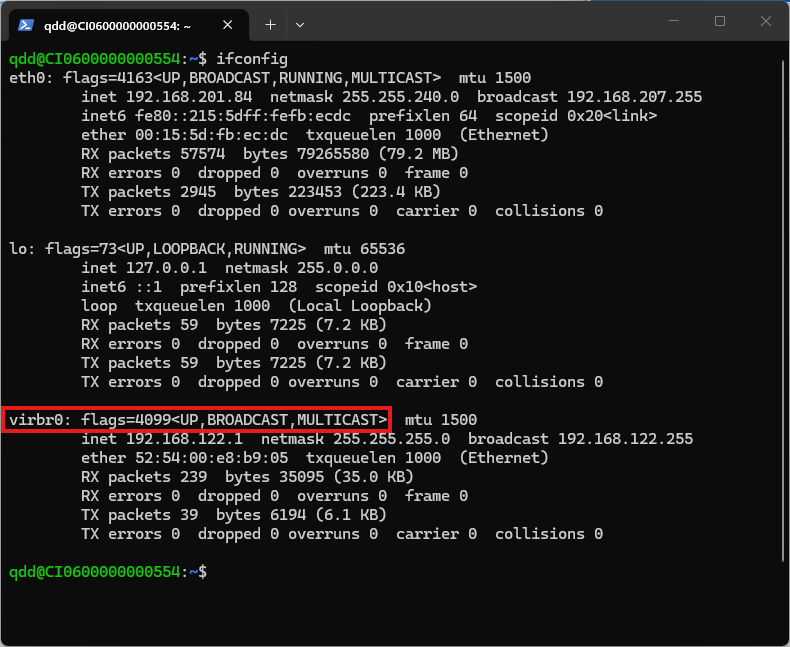
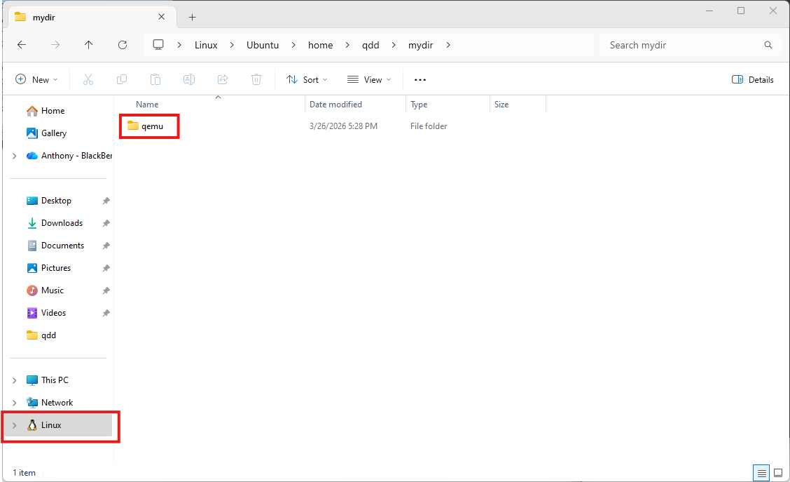
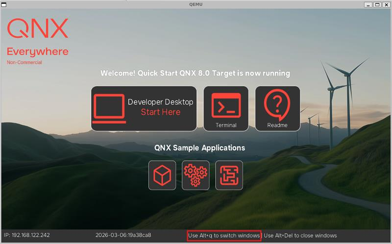

id: qsti-qemu-on-wsl
title: How to Run the Quick Start Target Image (QSTI) on QEMU using Windows Subsystem for Linux (WSL)
summary: Install prerequisites, configure, and run QSTI on QEMU with WSL on Windows 11.
categories: qnx, windows
tags: beginner
difficulty: 1
status: published
authors: Anthony Sabbagh
feedback_link: https://github.com/qnx/codelabs/issues


# How to Run the Quick Start Target Image (QSTI) on QEMU using Windows Subsystem for Linux (WSL)

## Introduction
Duration: 1:00

### Overview
This codelab is meant to be a step by step tutorial to help you get started with the QSTI in a virtualized environment on a Windows device. QEMU is typically used to run QSTI within the context of an Ubuntu system. Detailed documentation for using QSTI on QEMU on Ubuntu can be found [here.](https://www.qnx.com/developers/docs/qnxeverywhere/com.qnx.doc.target_images/topic/qsti_qemu/about.html) In this tutorial, we will use WSL which allows for Linux programs to run on Windows systems with minimal setup required. Therefore, the aforementioned documentation is mostly applicable and will be referenced in this tutorial.


### Prerequisites
* Supported platform: Windows 11 x86_64
* In the Windows settings, Scale is set to 100% (found in System → Display →  Scale & Layout). Other scaling may cause issues with the QEMU cursor.
* [QNX Software Center](https://www.qnx.com/download/group.html?programid=29178) installed.
* myQNX account with a [QNX SDP 8.0 Non-Commercial license](https://www.qnx.com/products/everywhere/).

---

## Installing WSL
Duration: 2:00

1. **Install WSL with PowerShell:** (refer to the [official documentation](https://learn.microsoft.com/en-us/windows/wsl/install) for more information)
    ```powershell
    wsl --install
    ```
    * At the time of writing, by default, this will install WSL 2 with the Ubuntu 24.04 distribution.
    * You can now open the Linux terminal by executing `wsl` from PowerShell or the Windows Command Prompt.
2. **Update Ubuntu Packages** by executing the following command from the linux terminal:
    ```bash
    sudo apt update && sudo apt upgrade
    ```

---

## Install QEMU
Duration: 2:00

1. **Install required packages** including the QEMU packages by executing the following command from the Linux shell:
    ```bash
    sudo apt install qemu-system qemu-system-x86 qemu-kvm libvirt-daemon-system libvirt-clients bridge-utils qemu-kvm virt-manager
    ```
2. **Set up the networking bridge** that QEMU will use for internet access by executing the following commands from the Linux terminal:
    ```bash
    sudo systemctl enable --now libvirtd
    sudo virsh net-start default
    sudo virsh net-autostart default
    sudo mkdir -p /etc/qemu
    echo "allow virbr0" | sudo tee /etc/qemu/bridge.conf
    sudo chmod 640 /etc/qemu/bridge.conf
    sudo chown root:kvm /etc/qemu/bridge.conf
    ```
    * Verify that the virbr0 interface is up.


---

## Acquire the QSTI Image
Duration: 5:00

1. Follow the steps here to [get the image.](https://www.qnx.com/developers/docs/qnxeverywhere/com.qnx.doc.target_images/topic/qsti_qemu/getting_started.html#getting-started__get-the-image)
2. Transfer the resulting qemu directory to the WSL filesystem using the Windows File Explorer.


---

## Run QEMU with correct arguments
Duration: 2:00

### Specifications
1. Starting with the default options [documented here](https://www.qnx.com/developers/docs/qnxeverywhere/com.qnx.doc.target_images/topic/qsti_qemu/additional_specs.html), let's add some more options to get things working well.
2. To improve performance, add the CPU and RAM specifications. This will depend on your system, but assuming a modern system with 16 GB of RAM, try `-smp 4` and `-m 8G` to specify 4 cores and 8 GB of RAM assigned to QEMU. With a more powerful system, you could increase that to 8 cores and 16 GB of RAM.
3. Since we are using QEMU, add the [physical bit specification](https://www.qnx.com/developers/docs/qnxeverywhere/com.qnx.doc.target_images/topic/qsti_qemu/additional_specs.html#additional-qemu-specifications__physical-bit-specification) according to whether you have an AMD or Intel CPU.
4. Specify the standard Virtio GPU driver with `-device virtio-vga-gl`.
5. Modify display specifications to ensure mouse input is captured correctly by adding `,show-cursor=on`.

### Execution
1. Open the Linux terminal (with `wsl`) and navigate with `cd` to the "qemu" directory you added to the WSL filesystem.
2. Execute the final version of the command:
    * AMD:
    ```
    sudo qemu-system-x86_64 \
    --enable-kvm \
    -drive file=output/disk-qemu.vmdk,if=ide,id=drv0 \
    -netdev bridge,br=virbr0,id=net0 \
    -device virtio-net-pci,netdev=net0,mac=52:54:00:91:01:ea \
    -pidfile output/qemu.pid \
    -nographic \
    -kernel output/ifs.bin \
    -serial mon:stdio \
    -object rng-random,filename=/dev/urandom,id=rng0 \
    -device virtio-rng-pci,rng=rng0 \
    -vga none \
    -display sdl,gl=on,show-cursor=on \
    -smp 4 \
    -m 8G \
    --cpu host,host-phys-bits-limit=40 \
    -device virtio-vga-gl
    ```
    * Intel:
    ```
    sudo qemu-system-x86_64 \
    --enable-kvm \
    -drive file=output/disk-qemu.vmdk,if=ide,id=drv0 \
    -netdev bridge,br=virbr0,id=net0 \
    -device virtio-net-pci,netdev=net0,mac=52:54:00:91:01:ea \
    -pidfile output/qemu.pid \
    -nographic \
    -kernel output/ifs.bin \
    -serial mon:stdio \
    -object rng-random,filename=/dev/urandom,id=rng0 \
    -device virtio-rng-pci,rng=rng0 \
    -vga none \
    -display sdl,gl=on,show-cursor=on \
    -smp 4 \
    -m 8G \
    --cpu host,host-phys-bits-limit=39 \
    -device virtio-vga-gl
    ```
---

## Modify Window Switching Hotkey

By default, Alt+Tab is used to switch between windows on the QSTI, but this does not work well with Windows 11 since that hotkey is already in use by the operating system.

1. Run QEMU as you did in the previous step.
2. In the terminal, log in as root (default password is root).
3. Choose a preferred hotkey combination. I am choosing Alt+q, but you can see all the valid hotkeys and modifier keys by executing `use fullscreen-winmgr`.
4. Execute the following command to make the change:
    ```
    sed -i '2i export WINMGR_HOTKEY=q\
    export WINMGR_KEYMOD=Alt' /system/etc/startup/full_startup.sh && sync
    ```
5. Close the QEMU graphical interface window.
6. Launch QEMU again and observe your specified hotkey now shows on the splash screen.


